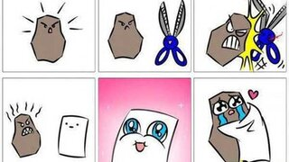
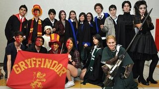
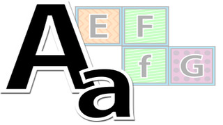
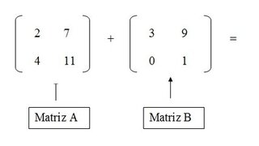

## @qxcode

### 01_ope

||||||
-|-|-|-|-|-|-
@006 L3 - Zerinho ou um americano (Calcule o vencedor)|@004 L3 - Mete bala (Distância entre dois pontos)|@005 L3 - Ladrão de Goiabas (Contando viagens)|@002 L2 - Pintando a casa (Calculando a área do triângulo)|@003 L2 - Opala bebedor (Cálculo de desempenho)|@000 L1 - Operações básicas (Imprimindo float formatado)|@011 L1 - Formatando data (Zeros à esquerda)

### 02_sel

||||||
-|-|-|-|-|-|-
@001 L3 - Sai fora Bhaskara (Cálculo de raízes)|@041 L3 - Rufus e Par ou Ímpar!|@042 L3 - Rufus e Ordenação!|@033 L3 - Professor Bonzinho|@036 L3 - Morre o do meio|@023 L3 - Jokenpo das tartarugas!|@037 L3 - Jokenpo 15

||||||
-|-|-|-|-|-|-
@157 L3 - Frota de Táxi - OBI 2005|@034 L3 - Formiga da bundona|@040 L3 - Está Trabalhand ou Não!|@043 L3 - Dorme Tarde Acordar Cedo!|@020 L2 - Zerinho ou Um!|@029 L2 - Quiz do Harry Potter|@014 L2 - Quantos são iguais? (Contando Repetidos)

||||||
-|-|-|-|-|-|-
@017 L2 - Ovos de galinha (Procurando o Maior valor)|@019 L2 - OBI 2017 - Fase 1 - Universitário - Game 10|@022 L2 - OBI 2017 - Fase 1 - Teleférico|@035 L2 - OBI 2017 - Fase 1 - Drone de Entrega|@039 L2 - Mercantil V2 - Maior ou Menor|@030 L2 - Mercantil V1 - Quem chega mais perto|@031 L2 - Fiquei de final

||||||
-|-|-|-|-|-|-
@183 L2 - Criança, Adulto, Idoso, Múmia|@028 L2 - Cadê a cabeça da cobra|@032 L2 - Bolada na fuça|@021 L2 - Aumento de Salário|@018 L2 - Arrendondar|@027 L2 - Adedonha na Califórnia|@038 L2 - A hora do próximo segundo

||||||
-|-|-|-|-|-|-
@026 L1 - Positivo, Nulo ou Negativo?|@155 L1 - OBI 2016 - Fase1 - Nível 1 - Plantação de Morangos!|@156 L1 - OBI 2016 - Fase1 - Nível 1 - Jogo de par ou ímpar|@151 L1 - OBI 2015 - Fase 2 - Nível 1 - Impedido!|@024 L1 - Divisão Inteira e Quebrada|@015 L1 - Calculadora Numérica|@062 L1 - Angulo Cartesiano - Operador Modular

||||||
-|-|-|-|-|-|-
@025 L1 - Ambos Divisíveis| | | | | | 

### 03_rep

||||||
-|-|-|-|-|-|-
@161 L3 - Vivo ou Morto - OBI 2005|@158 L3 - Trilhas - OBI 2005|@066 L3 - Spok Palíndromo|@065 L3 - Sapinho 3 matemático não morrendo no poço|@059 L3 - Sapinho 2 morrendo no poço|@054 L3 - Quebrador de Copos|@053 L3 - OBI 2016 - Fuga em helicóptero

||||||
-|-|-|-|-|-|-
@052 L3 - Hoje tem sopa de coelho?|@064 L3 - Conta Dígitos|@063 L3 - Blackjack 21!|@160 L3 - Bafo - OBI 2005|@051 L3 - Arremesso de pedra na lua|@047 L2 - Ônibus lotado|@016 L2 - Volta de 360 graus (Retirando os loops)

||||||
-|-|-|-|-|-|-
@136 L2 - Trilhas - OBI 2005 - (Modo Easy)|@049 L2 - Sapinho 1 no Poço|@057 L2 - Revolta em Portugal|@046 L2 - Jogo da Concentração|@050 L2 - Castelos de Cubos|@048 L2 - Cabo de Guerra Jedi|@058 L2 - Busca Intervalada

||||||
-|-|-|-|-|-|-
@045 L1 - Zero é par - Somatório de Pares!|@044 L1 - Somatório V2|@055 L1 - Quantos Ultrons você vê - Contar Elemento|@013 L1 - Dividindo pares de sapatos pra três|@056 L1 - Calça Zeze de Camargo - Mínimo| | 

### 04_vet

||||||
-|-|-|-|-|-|-
@084 L3 - Zoologico Um animal de cada tipo!|@087 L3 - Zoologico Entrando na Arca de Noé|@069 L3 - Zoo quantas especies!|@185 L3 - Vetor interativo|@088 L3 - Se fosse a mediana eu tinha passado!|@076 L3 - OBI 2017 - Fase 1 - O segredo do Cofre|@074 L3 - OBI 2017 - Fase 1 - Botas Trocadas

||||||
-|-|-|-|-|-|-
@071 L3 - Mário e o Assassins Creed - Parkour|@162 L3 - Mini-Poker - OBI2005|@077 L3 - Mercantil V3 - Muitas rodadas|@139 L3 - MMC de vários números.|@081 L3 - Loucura de Marquinhos - Decompor um inteiro|@079 L3 - Jogo do Avesso V2|@100 L3 - Jogando pião na rodinha

||||||
-|-|-|-|-|-|-
@008 L3 - Força Bruta (Gerando próxima combinação)|@085 L3 - Exército - Perto da morte|@086 L3 - Coleção de Tazos - Quantos se repetem mais|@070 L3 - Cabeças vão rolar|@010 L3 - Bolinhas viciadas(contagem de repetições)|@073 L3 - Batida Policial - Ordenando vetores|@080 L3 - Baruel Ruel trocando figurinhas!

||||||
-|-|-|-|-|-|-
@082 L3 - As unhas de Luiza - Vetor para inteiro|@083 L3 - Anfíbios e Batráquios - Está contido|@075 L3 - Abastecimento de água|@072 L2 - Soldados Pequenos e Grandes!|@067 L2 - Queda de dominós|@186 L2 - Processando uma linha de inteiros|@090 L2 - Primo

||||||
-|-|-|-|-|-|-
@068 L2 - Organizando a fila do RU - Separar Pares e Ímpares!|@101 L2 - Mostrar mão de cartas (Imprimir vetor formatado)|@091 L2 - MMC|@078 L2 - Jogo do Avesso|@061 L2 - Capoeira invertendo vetor!|@060 L1 - Joelison Fernandes - Soma do maior e menor!| 

### 05_str

||||||
-|-|-|-|-|-|-
@105 L3 - Valdiskley e cifras históricas!|@107 L3 - Valdiskley e a Cifra v3!|@123 L3 - Sorvete suor casaca chicletes - Letras em Comum!|@103 L3 - Separe Pneumatocito - Separação de Palavras!|@175 L3 - Separando a partir de tokens|@116 L3 - Roda Roda Jequiti|@112 L3 - Rocicleia e o Locioreca - Anagramas!

||||||
-|-|-|-|-|-|-
@179 L3 - Prof Muquirana - Busca máximo por critério|@152 L3 - OBI 2015 - Fase 2 - Nível 1 - Letras|@122 L3 - Nao se bububula - Gagueira V2!|@121 L3 - Mário e o Assassins Creed - Cenário|@115 L3 - Máquina de Datilografar Quebrada|@102 L3 - Meu cachorro comeu minha tarefa V2 - Retirar espaços duplicados|@114 L3 - MeU WoRd QuEbRoU - Formatação de Case!

||||||
-|-|-|-|-|-|-
@119 L3 - Matéria e Antimatéia - Colisão entre palavras!|@098 L3 - Jason e Krueguer - busca de maior ocorrencia|@178 L3 - Jack Sparrow e o Beijinho - Alternar Case|@108 L3 - Identificando elementos|@117 L3 - Identificando Ultrons V2|@120 L3 - Gansos Gamados - Verificar ordenação da frase!|@099 L3 - Francês é Fresco - Juntar palavras

||||||
-|-|-|-|-|-|-
@113 L3 - Eribelton e a Ascologia V3 - Busca do mínimo|@124 L3 - Conversa de Traficantes - Substituições de substrings|@118 L3 - Aniquilando Ultrons V3|@127 L3 - Amo a Amora meu Amor - Contar Substrings!|@094 L2 - Vogais e Consoantes - Identificação e Montagem!|@106 L2 - Valdiskley e a cifra V2!|@181 L2 - Somando numeros

||||||
-|-|-|-|-|-|-
@110 L2 - Organizando Ru - Homens e Mulheres!|@125 L2 - Numerão Divisível por 11|@111 L2 - Meu cachorro comeu minha tarefa - Retirar espaços|@089 L2 - Mega Jokenpo!|@180 L2 - Guerra Civil no Universo Marvel|@093 L2 - Gritando em Caixa Alta - Invertendo o Case da frase!|@097 L2 - Gagueira V1 - Duplicar Palavras

||||||
-|-|-|-|-|-|-
@109 L2 - Eribelton e a Ascologia V2 - Buscando a perfeição|@126 L2 - Crushômetro|@096 L2 - Contar Leds|@095 L2 - Avestruz com Alcaparras - Contar Maiusculas e Minusculas!|@174 L1 - Valdiskey e a cifra V1!|@176 L1 - Substring na decoração - Obter Substrings!|@177 L1 - Marileuza e as Alcaparras - Contar Ocorrencias!

||||||
-|-|-|-|-|-|-
@104 L1 - Maiúsculo, Minusculo e Dígito!|@092 L1 - LP da Xura - Inverter String!|@173 L1 - Eribelton e a Ascologia V1 - Somar Asc| | | | 

### 06_mat

||||||
-|-|-|-|-|-|-
@007 L3 - Tetris (Fazendo a peça cair)|@132 L3 - Subdiagonais|@154 L3 - OBI 2015 - Fase 2 - Nível Júnior - Código|@153 L3 - OBI 2015 - Fase 2 - Nível 1 - Torre|@131 L3 - Matriz Simétrica|@135 L3 - Jogo da vida|@159 L3 - Campo de Minhocas - OBI 2005

||||||
-|-|-|-|-|-|-
@129 L3 - Campo Minado|@150 L2 - Soma de matrizes|@128 L2 - Soma de elementos de em uma matriz|@133 L2 - Soldados em Posição|@134 L2 - Quadrado Mágico|@012 L2 - Deu a louca no Imperador!|@130 L2 - Bingo!

### 07_dic

||||||
-|-|-|-|-|-|-
@182 L3 - Mulher mais idosa|@149 L1 - Operações|@148 L1 - Expressão| | | | 

### 07_fun

||||||
-|-|-|-|-|-|-
@009 L2 - Imprimir vetor formatado| | | | | | 

### 07_rec

||||||
-|-|-|-|-|-|-
@146 L3 - Torres de Hanoi|@140 L3 - Contando caracteres recursivamente|@141 L2 - Números de Fibonacci|@145 L2 - Contando caracteres recursivamente| | | 

### 09_alo

||||||
-|-|-|-|-|-|-
@142 L2 - Vetor de strings com variados tamanhos| | | | | | 

### 10_ptr

||||||
-|-|-|-|-|-|-
@144 L2 - Função que retorna vários valores por referência|@143 L1 - Troca de valores de variáveis|@147 L1 - Duelo| | | | 

### 11_cla

||||||
-|-|-|-|-|-|-
@184 L3 - Motivando a turma de secundaristas| | | | | | 

