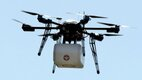
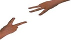
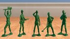
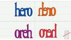
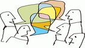
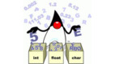

# QxcodeFup

Esse repositório foi criado e é mantido por mim, David Sena (sena@ufc.br), professor da UFC de Quixadá.

Aqui na UFC, nós utilizamos essas atividades no ensino das disciplinas de Fundamentos de Computação.

As atividades normalmente são utilizadas dentro do Moodle utilizando o plugin do VPL.

Também pode executá-las diretamente no seu computador ou no replit através do [TKO](https://github.com/senapk/tko).  

<!-- toc -->
- [01. Operações: Impressão formatada](#01-operações-impressão-formatada)
- [02. Operações: Biblioteca Math](#02-operações-biblioteca-math)
- [03. Seleção: Manipulação](#03-seleção-manipulação)
- [04. Seleção: Biblioteca Math](#04-seleção-biblioteca-math)
- [05. Seleção: Lógica](#05-seleção-lógica)
- [06. Seleção: Operador de módulo](#06-seleção-operador-de-módulo)
- [07. Seleção: Intervalos](#07-seleção-intervalos)
- [08. Seleção: Busca e Contagem](#08-seleção-busca-e-contagem)
- [09. Seleção: Conversão](#09-seleção-conversão)
- [10. Laço: Básico](#10-laço-básico)
- [11. Laço: Técnicas de controle](#11-laço-técnicas-de-controle)
- [12. Laço: Math](#12-laço-math)
- [13. Vetores: Busca](#13-vetores-busca)
- [14. Vetores: Contagem](#14-vetores-contagem)
- [15. Vetores: Conversão](#15-vetores-conversão)
- [16. Vetores: Manipulação](#16-vetores-manipulação)
- [17. Vetores: Proximidade](#17-vetores-proximidade)
- [18. Vetores: Ordenação](#18-vetores-ordenação)
- [19. Vetores: Lógica](#19-vetores-lógica)
- [20. Vetores: Math](#20-vetores-math)
- [21. Strings I](#21-strings-i)
- [22. Strings II](#22-strings-ii)
- [23. Strings III](#23-strings-iii)
- [24. Strings IV](#24-strings-iv)
- [25. Matrizes I](#25-matrizes-i)
- [26. Matrizes II](#26-matrizes-ii)
- [27. Ponteiros](#27-ponteiros)
- [28. Recursão](#28-recursão)
- [29. Structs](#29-structs)
<!-- toc -->

```txt
Conteúdo sugeridos
- instalando o mingw e vscode
- tipos de dados básicos: `bool, int, float, char, const char *`
- operadores aritméticos: `+ - * / %`
- lendo e escrevendo variáveis: scanf, printf, puts, getchar
- uso avançado do scanf
- maldição da leitura do char, lendo ou ignorando whitespaces
- lendo errado a entrada, limpando o buffer
- como funciona o buffer de entrada
- utilizando funções da biblioteca math.h
- debugando
```

## 01. Operações: Impressão formatada

 | [@024 L1 - Divisão Inteira e Quebrada 💎](base/024/Readme.md#l1---divisão-inteira-e-quebrada-)
 | [@000 L1 - Operações básicas](base/000/Readme.md#l1---operações-básicas)
 | [@011 L2 - Formatando data](base/011/Readme.md#l2---formatando-data)

## 02. Operações: Biblioteca Math

 | [@002 L2 - Pintando a casa 🎥💎](base/002/Readme.md#l2---pintando-a-casa-)
 | [@003 L2 - Opala bebedor 🎥💎](base/003/Readme.md#l2---opala-bebedor-)
 | [@196 L2 - Comprando TV parcelado](base/196/Readme.md#l2---comprando-tv-parcelado)
 | [@004 L3 - Mete bala](base/004/Readme.md#l3---mete-bala)

```txt
- Funções
    - recebendo e retornando básicos
    - retorno de função: retorno default e returnos parciais ao invés de elses
- Estruturas de Seleção
    - Indentação, estruturas básicas e uso de operadores lógicos de corte
    - if, else, else if
    - Operadores lógicos: `&&, ||, !`
    - Operadores relacionais: `==, !=, >, <, >=, <=`
    - Operador ternário
```

## 03. Seleção: Manipulação

 | [@015 L1 - Calculadora Numérica 💎](base/015/Readme.md#l1---calculadora-numérica-)
 | [@155 L1 - Plantação de Morangos 💎](base/155/Readme.md#l1---plantação-de-morangos-)
 | [@151 L1 - Impedido!](base/151/Readme.md#l1---impedido)
 | [@026 L1 - Positivo, Nulo ou Negativo?](base/026/Readme.md#l1---positivo-nulo-ou-negativo)
 | [@203 L1 - Cláusulas de guarda](base/203/Readme.md#l1---cláusulas-de-guarda)
 | [@031 L2 - Fiquei de final](base/031/Readme.md#l2---fiquei-de-final)
 | [@040 L2 - Está Trabalhando ou Não!](base/040/Readme.md#l2---está-trabalhando-ou-não)
 | [@035 L2 - Drone de Entrega - OBI 2017 - Fase 1](base/035/Readme.md#l2---drone-de-entrega---obi-2017---fase-1)
 | [@164 L2 - Triângulo de varetas](base/164/Readme.md#l2---triângulo-de-varetas)

## 04. Seleção: Biblioteca Math

 | [@018 L2 - Arredondar](base/018/Readme.md#l2---arredondar)
 | [@030 L2 - Mercantil V1 - Quem chega mais perto](base/030/Readme.md#l2---mercantil-v1---quem-chega-mais-perto)
 | [@039 L2 - Mercantil V2 - Maior ou Menor](base/039/Readme.md#l2---mercantil-v2---maior-ou-menor)
 | [@001 L2 - Bhaskara](base/001/Readme.md#l2---bhaskara)

## 05. Seleção: Lógica

 | [@157 L1 - Frota de Táxi - OBI 2005](base/157/Readme.md#l1---frota-de-táxi---obi-2005)
 | [@014 L1 - Quantos são iguais?](base/014/Readme.md#l1---quantos-são-iguais)
 | [@156 L2 - Jogo de par ou ímpar - OBI 2016 - F1P1](base/156/Readme.md#l2---jogo-de-par-ou-ímpar---obi-2016---f1p1)
 | [@194 L2 - Nota cortada - OBI 2019 F1P1](base/194/Readme.md#l2---nota-cortada---obi-2019-f1p1)
 | [@023 L2 - Jokenpo das tartarugas](base/023/Readme.md#l2---jokenpo-das-tartarugas)
 | [@020 L2 - Zerinho ou Um](base/020/Readme.md#l2---zerinho-ou-um)

## 06. Seleção: Operador de módulo

 | [@062 L2 - Angulo Cartesiano](base/062/Readme.md#l2---angulo-cartesiano)
 | [@025 L1 - Ambos Divisíveis](base/025/Readme.md#l1---ambos-divisíveis)
 | [@022 L2 - Teleférico - OBI 2017 - Fase 1](base/022/Readme.md#l2---teleférico---obi-2017---fase-1)
 | [@195 L2 - Xadrez OBI 2019 F1P1](base/195/Readme.md#l2---xadrez-obi-2019-f1p1)
 | [@193 L2 - Dominó - OBI 2019 F1PJ](base/193/Readme.md#l2---dominó---obi-2019-f1pj)
 | [@005 L2 - Ladrão de Goiabas](base/005/Readme.md#l2---ladrão-de-goiabas)
 | [@028 L2 - Cabeça da cobra](base/028/Readme.md#l2---cabeça-da-cobra)
 | [@016 L2 - Volta de 360 graus - Retirando os loops](base/016/Readme.md#l2---volta-de-360-graus---retirando-os-loops)
 | [@019 L2 - Game 10 - OBI 2017 - Fase 1 - Universitário](base/019/Readme.md#l2---game-10---obi-2017---fase-1---universitário)
 | [@034 L3 - Formiga da bundona](base/034/Readme.md#l3---formiga-da-bundona)
 | [@006 L3 - Zerinho ou um americano - Decifrando a fórmula](base/006/Readme.md#l3---zerinho-ou-um-americano---decifrando-a-fórmula)
 | [@037 L3 - Jokenpo 15](base/037/Readme.md#l3---jokenpo-15)

## 07. Seleção: Intervalos

 | [@021 L2 - Aumento de Salário](base/021/Readme.md#l2---aumento-de-salário)
 | [@032 L2 - Bolada na fuça](base/032/Readme.md#l2---bolada-na-fuça)
 | [@183 L2 - Criança ou Múmia](base/183/Readme.md#l2---criança-ou-múmia)

## 08. Seleção: Busca e Contagem

 | [@017 L2 - Maior ovo](base/017/Readme.md#l2---maior-ovo)
 | [@192 L2 - A idade de Dona Mônica - OBI 2019 - F1PJ](base/192/Readme.md#l2---a-idade-de-dona-mônica---obi-2019---f1pj)
 | [@029 L2 - Quiz do Harry Potter](base/029/Readme.md#l2---quiz-do-harry-potter)
 | [@036 L3 - Morre o do meio](base/036/Readme.md#l3---morre-o-do-meio)
 | [@033 L3 - Professor Bonzinho](base/033/Readme.md#l3---professor-bonzinho)

## 09. Seleção: Conversão

 | [@038 L2 - Próximo segundo](base/038/Readme.md#l2---próximo-segundo)
 | [@027 L2 - Adedonha 💎](base/027/Readme.md#l2---adedonha-)
 | [@043 L3 - Horas de sono](base/043/Readme.md#l3---horas-de-sono)

```txt
- Seleção: if, else, else if
- Controle: for, while, do while
- Controle de laço: break, continue
- Funções com returns parciais
```

## 10. Laço: Básico

 | [@013 L1 - Sapatos para 3](base/013/Readme.md#l1---sapatos-para-3)
 | [@045 L1 - Soma dos pares](base/045/Readme.md#l1---soma-dos-pares)
 | [@053 L2 - Fuga em helicóptero - OBI 2016](base/053/Readme.md#l2---fuga-em-helicóptero---obi-2016)
 | [@046 L2 - Jogo da Concentração 💎](base/046/Readme.md#l2---jogo-da-concentração-)

## 11. Laço: Técnicas de controle

 | [@047 L2 - Ônibus lotado](base/047/Readme.md#l2---ônibus-lotado)
 | [@049 L2 - Sapinho 1 no Poço](base/049/Readme.md#l2---sapinho-1-no-poço)
 | [@059 L3 - Sapinho 2 morrendo no poço](base/059/Readme.md#l3---sapinho-2-morrendo-no-poço)
 | [@065 L3 - Sapinho 3 matemático](base/065/Readme.md#l3---sapinho-3-matemático)
 | [@050 L2 - Castelos de Cubos](base/050/Readme.md#l2---castelos-de-cubos)
 | [@054 L3 - Quebrador de Copos](base/054/Readme.md#l3---quebrador-de-copos)

## 12. Laço: Math

 | [@090 L2 - Primo 💎](base/090/Readme.md#l2---primo-)
 | [@189 L2 - Fatores de um número](base/189/Readme.md#l2---fatores-de-um-número)
 | [@052 L3 - Sopa de coelho?](base/052/Readme.md#l3---sopa-de-coelho)
 | [@160 L3 - Somatório de Fibonacci](base/160/Readme.md#l3---somatório-de-fibonacci)
 | [@066 L2 - Spok Palíndromo](base/066/Readme.md#l2---spok-palíndromo)
 | [@064 L3 - Conta Dígitos 🎥💎](base/064/Readme.md#l3---conta-dígitos-)

## 13. Vetores: Busca

 | [@056 L1 - Calça apertada](base/056/Readme.md#l1---calça-apertada)
 | [@060 L1 - Casamento](base/060/Readme.md#l1---casamento)
 | [@051 L3 - Pedra na lua](base/051/Readme.md#l3---pedra-na-lua)
 | [@058 L2 - Busca Intervalada](base/058/Readme.md#l2---busca-intervalada)
 | [@100 L3 - Pião perto da linha](base/100/Readme.md#l3---pião-perto-da-linha)

## 14. Vetores: Contagem

 | [@055 L1 - Contagem](base/055/Readme.md#l1---contagem)
 | [@048 L2 - Cabo de Guerra Jedi](base/048/Readme.md#l2---cabo-de-guerra-jedi)
 | [@057 L2 - Revolta em Portugal](base/057/Readme.md#l2---revolta-em-portugal)
 | [@072 L2 - Soldados PMG!](base/072/Readme.md#l2---soldados-pmg)
 | [@077 L3 - Mercantil V3 - Muitas rodadas](base/077/Readme.md#l3---mercantil-v3---muitas-rodadas)

## 15. Vetores: Conversão

 | [@101 L2 - Mostrar cartas](base/101/Readme.md#l2---mostrar-cartas)
 | [@063 L3 - Blackjack 21!](base/063/Readme.md#l3---blackjack-21)
 | [@188 L3 - Devolvendo o troco](base/188/Readme.md#l3---devolvendo-o-troco)
 | [@082 L3 - Vetor para inteiro](base/082/Readme.md#l3---vetor-para-inteiro)

## 16. Vetores: Manipulação

 | [@061 L2 - Invertendo vetor](base/061/Readme.md#l2---invertendo-vetor)
 | [@091 L2 - MMC](base/091/Readme.md#l2---mmc)
 | [@068 L2 - Fila do RU](base/068/Readme.md#l2---fila-do-ru)
 | [@186 L2 - Linha de inteiros 🎥💎](base/186/Readme.md#l2---linha-de-inteiros-)
 | [@161 L3 - Vivo ou Morto - OBI 2005](base/161/Readme.md#l3---vivo-ou-morto---obi-2005)
 | [@081 L3 - Decompor um inteiro](base/081/Readme.md#l3---decompor-um-inteiro)
 | [@087 L3 - Arca: Quantos casais](base/087/Readme.md#l3---arca-quantos-casais)
 | [@084 L3 - Arca: Exemplares](base/084/Readme.md#l3---arca-exemplares)

## 17. Vetores: Proximidade

 | [@067 L2 - Queda de dominós](base/067/Readme.md#l2---queda-de-dominós)
 | [@078 L2 - Jogo do Avesso](base/078/Readme.md#l2---jogo-do-avesso)
 | [@136 L2 - Trilhas Easy- OBI 2005](base/136/Readme.md#l2---trilhas-easy--obi-2005)
 | [@158 L3 - Trilhas - OBI 2005](base/158/Readme.md#l3---trilhas---obi-2005)
 | [@071 L3 - Parkour](base/071/Readme.md#l3---parkour)
 | [@085 L3 - Perto do médico](base/085/Readme.md#l3---perto-do-médico)
 | [@079 L3 - Jogo do Avesso V2](base/079/Readme.md#l3---jogo-do-avesso-v2)

## 18. Vetores: Ordenação

 | [@198 L1 - Paredes](base/198/Readme.md#l1---paredes)
 | [@073 L2 - Batida Policial](base/073/Readme.md#l2---batida-policial)
 | [@200 L2 - Vacina](base/200/Readme.md#l2---vacina)
 | [@088 L2 - Mediana](base/088/Readme.md#l2---mediana)
 | [@197 L2 - Indices](base/197/Readme.md#l2---indices)

## 19. Vetores: Lógica

 | [@075 L3 - Abastecimento de água](base/075/Readme.md#l3---abastecimento-de-água)
 | [@083 L3 - Batráquios](base/083/Readme.md#l3---batráquios)
 | [@080 L3 - Figurinhas](base/080/Readme.md#l3---figurinhas)
 | [@086 L3 - Tazos](base/086/Readme.md#l3---tazos)
 | [@010 L3 - Bolinhas viciadas](base/010/Readme.md#l3---bolinhas-viciadas)
 | [@070 L3 - Cabeças vão rolar](base/070/Readme.md#l3---cabeças-vão-rolar)
 | [@074 L3 - Botas Trocadas - OBI 2017](base/074/Readme.md#l3---botas-trocadas---obi-2017)
 | [@076 L3 - O segredo do Cofre - OBI 2017](base/076/Readme.md#l3---o-segredo-do-cofre---obi-2017)
 | [@042 L3 - Chefe Nervoso - OBI 2021](base/042/Readme.md#l3---chefe-nervoso---obi-2021)

## 20. Vetores: Math

 | [@138 L3 - Permutação](base/138/Readme.md#l3---permutação)
 | [@008 L3 - Senhas](base/008/Readme.md#l3---senhas)
 | [@190 L4 - Maiores Palíndromos](base/190/Readme.md#l4---maiores-palíndromos)

## 21. Strings I

 | [@173 L1 - Eribelton e a Ascologia V1 - Somar Asc](base/173/Readme.md#l1---eribelton-e-a-ascologia-v1---somar-asc)
 | [@092 L1 - LP da Xuxa - Inverter String!](base/092/Readme.md#l1---lp-da-xuxa---inverter-string)
 | [@104 L1 - Maiúsculo, Minusculo e Dígito!](base/104/Readme.md#l1---maiúsculo-minusculo-e-dígito)
 | [@177 L1 - Marileuza e as Alcaparras - Contar Ocorrências!](base/177/Readme.md#l1---marileuza-e-as-alcaparras---contar-ocorrências)
 | [@176 L1 - Substring na decoração - Obter Substrings!](base/176/Readme.md#l1---substring-na-decoração---obter-substrings)
 | [@174 L1 - Valdiskey e a cifra V1!](base/174/Readme.md#l1---valdiskey-e-a-cifra-v1)
 | [@095 L2 - Avestruz com Alcaparras](base/095/Readme.md#l2---avestruz-com-alcaparras)
 | [@096 L2 - Contar Leds](base/096/Readme.md#l2---contar-leds)
 | [@126 L2 - Crushômetro](base/126/Readme.md#l2---crushômetro)
 | [@109 L2 - Eribelton e a Ascologia V2](base/109/Readme.md#l2---eribelton-e-a-ascologia-v2)
 | [@097 L2 - Gagueira V1 - Duplicar Palavras](base/097/Readme.md#l2---gagueira-v1---duplicar-palavras)
 | [@093 L2 - Gritando em Caixa Alta](base/093/Readme.md#l2---gritando-em-caixa-alta)

## 22. Strings II

 | [@180 L2 - Guerra Civil no Universo Marvel](base/180/Readme.md#l2---guerra-civil-no-universo-marvel)
 | [@089 L2 - Mega Jokenpo!](base/089/Readme.md#l2---mega-jokenpo)
 | [@111 L2 - Meu cachorro comeu minha tarefa](base/111/Readme.md#l2---meu-cachorro-comeu-minha-tarefa)
 | [@125 L2 - Numerão Divisível por 11](base/125/Readme.md#l2---numerão-divisível-por-11)
 | [@110 L2 - Organizando Ru - Homens e Mulheres!](base/110/Readme.md#l2---organizando-ru---homens-e-mulheres)
 | [@181 L2 - Somando numeros](base/181/Readme.md#l2---somando-numeros)
 | [@106 L2 - Valdiskley e a cifra V2!](base/106/Readme.md#l2---valdiskley-e-a-cifra-v2)
 | [@094 L2 - Vogais e Consoantes](base/094/Readme.md#l2---vogais-e-consoantes)
 | [@163 L4 - Permutação Lexograficamente Final de Fichas](base/163/Readme.md#l4---permutação-lexograficamente-final-de-fichas)
 | [@127 L3 - Amo a Amora meu Amor](base/127/Readme.md#l3---amo-a-amora-meu-amor)
 | [@124 L3 - Conversa de Traficantes](base/124/Readme.md#l3---conversa-de-traficantes)
 | [@113 L3 - Eribelton e a Ascologia V3](base/113/Readme.md#l3---eribelton-e-a-ascologia-v3)

## 23. Strings III

 | [@099 L3 - Francês é Fresco](base/099/Readme.md#l3---francês-é-fresco)
 | [@120 L3 - Gansos Gamados](base/120/Readme.md#l3---gansos-gamados)
 | [@117 L3 - Identificando Ultrons V2](base/117/Readme.md#l3---identificando-ultrons-v2)
 | [@118 L3 - Aniquilando Ultrons V3](base/118/Readme.md#l3---aniquilando-ultrons-v3)
 | [@108 L3 - Identificando elementos](base/108/Readme.md#l3---identificando-elementos)
 | [@178 L3 - Jack Sparrow e o Beijinho](base/178/Readme.md#l3---jack-sparrow-e-o-beijinho)
 | [@098 L3 - Jason e Krueguer](base/098/Readme.md#l3---jason-e-krueguer)
 | [@152 L3 - Letras Ordenadas](base/152/Readme.md#l3---letras-ordenadas)
 | [@119 L3 - Matéria e Antimatéria](base/119/Readme.md#l3---matéria-e-antimatéria)
 | [@114 L3 - MeU WoRd QuEbRoU](base/114/Readme.md#l3---meu-word-quebrou)
 | [@102 L3 - Meu cachorro comeu minha tarefa V2](base/102/Readme.md#l3---meu-cachorro-comeu-minha-tarefa-v2)
 | [@115 L3 - Máquina de Datilografar Quebrada](base/115/Readme.md#l3---máquina-de-datilografar-quebrada)

## 24. Strings IV

 | [@121 L3 - Mário e o Assassins Creed](base/121/Readme.md#l3---mário-e-o-assassins-creed)
 | [@122 L3 - Nao se bububula - Gagueira V2!](base/122/Readme.md#l3---nao-se-bububula---gagueira-v2)
 | [@179 L3 - Prof Muquirana - Busca máximo por critério](base/179/Readme.md#l3---prof-muquirana---busca-máximo-por-critério)
 | [@112 L3 - Rocicleia e o Locioreca - Anagramas!](base/112/Readme.md#l3---rocicleia-e-o-locioreca---anagramas)
 | [@116 L3 - Roda Roda Jequiti](base/116/Readme.md#l3---roda-roda-jequiti)
 | [@175 L3 - Separando a partir de tokens](base/175/Readme.md#l3---separando-a-partir-de-tokens)
 | [@103 L3 - Separe Pneumatócito - Separação de Palavras!](base/103/Readme.md#l3---separe-pneumatócito---separação-de-palavras)
 | [@123 L3 - Sorvete suor casaca chicletes - Letras em Comum!](base/123/Readme.md#l3---sorvete-suor-casaca-chicletes---letras-em-comum)
 | [@107 L3 - Valdiskley e a Cifra v3!](base/107/Readme.md#l3---valdiskley-e-a-cifra-v3)
 | [@105 L3 - Valdiskley e cifras históricas!](base/105/Readme.md#l3---valdiskley-e-cifras-históricas)
 | [@162 L3 - Mini-Poker - OBI2005](base/162/Readme.md#l3---mini-poker---obi2005)
 | [@041 L3 - Criptografia](base/041/Readme.md#l3---criptografia)

## 25. Matrizes I

 | [@130 L2 - Bingo!](base/130/Readme.md#l2---bingo)
 | [@012 L2 - Deu a louca no Imperador](base/012/Readme.md#l2---deu-a-louca-no-imperador)
 | [@191 L2 - Coluna de Valor Maior](base/191/Readme.md#l2---coluna-de-valor-maior)
 | [@134 L2 - Quadrado Mágico](base/134/Readme.md#l2---quadrado-mágico)
 | [@128 L2 - Soma de elementos de em uma matriz](base/128/Readme.md#l2---soma-de-elementos-de-em-uma-matriz)
 | [@153 L3 - Torre - OBI 2015 - Fase 2 - Nível 1](base/153/Readme.md#l3---torre---obi-2015---fase-2---nível-1)
 | [@133 L2 - Soldados em Posição](base/133/Readme.md#l2---soldados-em-posição)

## 26. Matrizes II

 | [@131 L2 - Matriz Simétrica](base/131/Readme.md#l2---matriz-simétrica)
 | [@150 L2 - Soma de matrizes](base/150/Readme.md#l2---soma-de-matrizes)
 | [@132 L2 - Subdiagonais](base/132/Readme.md#l2---subdiagonais)
 | [@135 L3 - Jogo da vida](base/135/Readme.md#l3---jogo-da-vida)
 | [@007 L3 - Tetris (Fazendo a peça cair)](base/007/Readme.md#l3---tetris-fazendo-a-peça-cair)
 | [@129 L3 - Campo Minado](base/129/Readme.md#l3---campo-minado)
 | [@159 L3 - Campo de Minhocas - OBI 2005](base/159/Readme.md#l3---campo-de-minhocas---obi-2005)
 | [@154 L3 - Código - OBI 2015 - Fase 2 - Nível Júnior](base/154/Readme.md#l3---código---obi-2015---fase-2---nível-júnior)

## 27. Ponteiros

 | [@009 L2 - Imprimir vetor formatado](base/009/Readme.md#l2---imprimir-vetor-formatado)
 | [@139 L4 - A Porta Matemática](base/139/Readme.md#l4---a-porta-matemática)
 | [@147 L1 - Duelo](base/147/Readme.md#l1---duelo)
 | [@143 L1 - Troca de valores de variáveis](base/143/Readme.md#l1---troca-de-valores-de-variáveis)
 | [@144 L2 - Função que retorna vários valores por referência](base/144/Readme.md#l2---função-que-retorna-vários-valores-por-referência)
 | [@142 L2 - Vetor de strings com variados tamanhos](base/142/Readme.md#l2---vetor-de-strings-com-variados-tamanhos)

## 28. Recursão

 | [@145 L2 - Contando ocorrências](base/145/Readme.md#l2---contando-ocorrências)
 | [@141 L2 - Números de Fibonacci](base/141/Readme.md#l2---números-de-fibonacci)
 | [@140 L3 - Contando caracteres recursivamente](base/140/Readme.md#l3---contando-caracteres-recursivamente)
 | [@146 L3 - Torres de Hanoi](base/146/Readme.md#l3---torres-de-hanoi)

## 29. Structs

 | [@148 L1 - Expressão](base/148/Readme.md#l1---expressão)
 | [@149 L1 - Operações](base/149/Readme.md#l1---operações)
 | [@199 L2 - Pizza](base/199/Readme.md#l2---pizza)
 | [@201 L2 - Comparar Data](base/201/Readme.md#l2---comparar-data)
 | [@069 L2 - Retângulo](base/069/Readme.md#l2---retângulo)
 | [@202 L2 - Ponto perto](base/202/Readme.md#l2---ponto-perto)
 | [@187 L2 - Jogo da cobrinha](base/187/Readme.md#l2---jogo-da-cobrinha)
 | [@184 L3 - Secundaristas](base/184/Readme.md#l3---secundaristas)
 | [@182 L3 - Mulher mais idosa](base/182/Readme.md#l3---mulher-mais-idosa)
