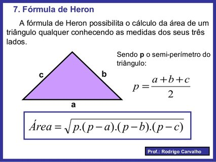

## #operações L2 - Pintando a casa - Calculando a área do triângulo


## Motivação

Fernando comprou uma casa triangular. Na hora de calcular a quantidade de tinta pra pintar, precisou descobrir como calcular a área de um triângulo. Deu de cara com a fórmula de Heron.

## Ação

Utilize a seguinte fórmula para calcular a área de um triângulo a partir do tamanho de seus lados.



### Entrada
- 3 lados em float, um por linha

### Saída
- Área com duas casas decimais.

## Exemplos

```
>>>>>>>>
4
3
5
========
6.00
<<<<<<<<

>>>>>>>>
10
12
16
========
59.92
<<<<<<<<
```


