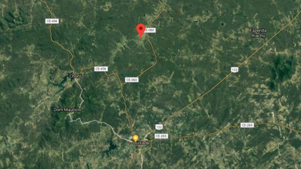

## @0027 #02_sel L2 - Adedonha na Califórnia
## @qxcode



## Motivação

Três irmãos da Califórnia (um distrito da cidade de Quixadá) estavam debaixo do pé de jambo entediados quando iniciam o seguinte diálogo.

\- Pedro: Bó brincar de adedonha?  

\- Tiago: Qual tema?

\- João: Adjetivos que mamãe usa lá em casa.

\- Pedro: Xou!

\- Pedro, Tiago e João: Adedoooooooooonha!

\- 10, 9, 8 dedos: A, B, C, D, ............., A  

\- Abestado

\- Azilado

\- Abufelado

\- Aloprado

\- Abirobado  

\- Azucrinado

\- Amufinado

\- Arretado

\- Avexado

\- Arrombado

\- Tiago: Perdeu, mamãe nunca te chamou disso!

\- João: o cadeado, bocó, ela disse ontem pro papai: ô miséria, o ladrão safado roubou o botijão e deixou o cadeado todo arrombado.

## Ação

Leia a soma dos dedos dos três irmãos e diga qual a letra L que será utilizada no jogo.

### Entrada 
- Um inteiro representando a soma dos dedos dos 3 irmãos

### Saída
- A letra correspondente ou "Joguem de novo" se ninguém colocou nenhum dedo.

## Limites

0 <= SOMA (D1 + D2 + D3) <= 100.

## Exemplos

```
>>>>>>>>
0 
========
joguem de novo
<<<<<<<<

>>>>>>>>
1
========
a
<<<<<<<<

>>>>>>>>
2
========
b
<<<<<<<<

>>>>>>>>
26
========
z
<<<<<<<<

>>>>>>>>
27
========
a
<<<<<<<<
```

#

<!---
>>>>>>>>
28
========
b
<<<<<<<<

>>>>>>>>
52
========
z
<<<<<<<<

>>>>>>>>
53
========
a
<<<<<<<<

>>>>>>>>
30
========
d
<<<<<<<<


>>>>>>>>
54
========
b
<<<<<<<<


>>>>>>>>
80
========
b
<<<<<<<<


>>>>>>>>
150
========
t
<<<<<<<<

--->