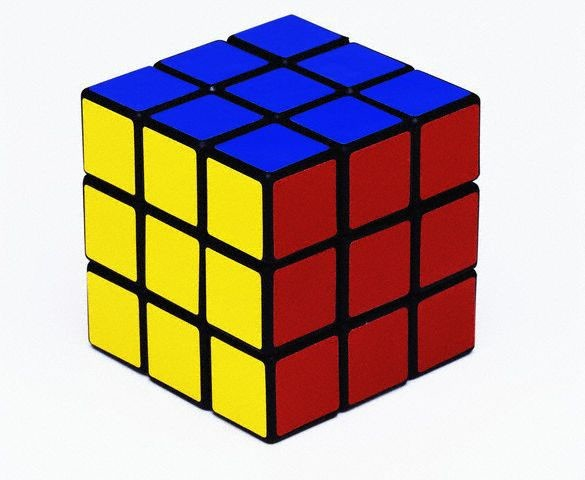

# @0134 #5_mat L2 - Quadrado Mágico
## @qxcode

# @qxcode

### 

### Motivação

Dizemos que uma matriz quadrada inteira é um quadrado mágico se a soma dos elementos de cada linha, a soma dos elementos de cada coluna e a soma dos elementos das diagonais principal e secundária são todas iguais.  
  

### Ação

Diga se a uma matriz de elementos inteiros 3x3 dada como entrada é quadrado mágico ou não.  
  

### Entrada e Saída

Entrada

*   A matriz 3x3

Saída

*   "sim" se for quadrado mágico e "nao" caso contrário.

  

### Exemplos

    >>>>>>>>
    1 2 3 
    4 5 6 
    7 8 9 
    ========
    nao
    <<<<<<<<
    

* * * 

    >>>>>>>>
    2 7 6
    10 9 5 1
    11 4 3 8
    ========
    sim
    <<<<<<<<