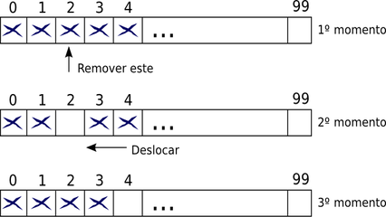

## @0136 #7_math Random no vetor Laboratório Virtual de Programação
## @qxcode

### Ação

Faça uma função que receba um vetor e selecione aleatóriamente um elemento desse vetor. Remova-o e retorne-o como resultado da função.

Sugestão de remoção: troque o elemento selecionado com o último elemento e diminua o tamanho do vetor em 1.

Se for em C faça: int sortear(int \* vet, int \* tam)

### Entrada e Saida

#### Entrada: 

    *   Um vetor do tipo inteiro de tamanho n.

#### Saida:

    *   Um elemento aleatório do vetor