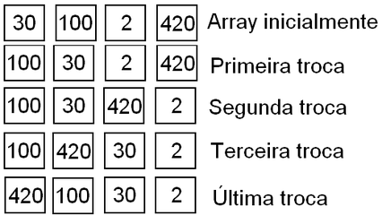

## @137 #7_math - Embaralhar Vetor Laboratório Virtual de Programação
## @qxcode

### Ação

Dado um vetor, embaralhe aleatoriamente os elementos desse vetor.

Se for em C faça:

void embaralhar(int \* vet, int tam)

### Entrada e Saida

#### Entrada:

    *   Um vetor do tipo inteiro de tamanho n.  

#### Saida:

    *   O vetor com os elementos embaralhados