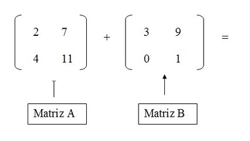

## @0150 #06_mat L2 - Soma de matrizes
## @qxcode



### Ação

Leia duas matrizes A e B com mesmo número de linhas e colunas, e em seguida calcule e imprima a soma destas matrizes. Se S é a soma das matrizes A e B, então cada elemento S\[i\]\[j\] é calculado como A\[i\]\[j\] + B\[i\]\[j\], ou seja, a soma dos elementos de mesma posição nas matrizes A e B.

### Entrada e saída

#### Entrada:

    \- Linha 1: número de linhas das matrizes A e B.  
    \- Linha 2: número de colunas das matrizes A e B.  
    \- Linhas da matriz A.  
    \- Linhas da matriz B.

#### Saída:  
    \- Linhas da matriz S = A + B.

### Exemplos

```
>>>>>>>>
2
3
1 2 3
4 5 6
1 1 1
2 2 2
========
2 3 4
6 7 8
<<<<<<<<

>>>>>>>>
2
1
1
2
3
4
========
4
6
<<<<<<<<
```

<!---
>>>>>>>> 01
2
3
1 2 3
4 5 6
1 1 1
2 2 2
========
2 3 4
6 7 8
<<<<<<<<

>>>>>>>> 02
2
1
1
2
3
4
========
4
6
<<<<<<<<

>>>>>>>> 03
3
3
6 1 8
0 7 5
3 2 4
1 6 0
7 5 4
3 8 2
========
7 7 8
7 12 9
6 10 6
<<<<<<<<

>>>>>>>> 04
1
1
2
3
========
5
<<<<<<<<

>>>>>>>> 05
2
2
0 0
0 0
-1 0
1 2
========
-1 0
1 2
<<<<<<<<
--->