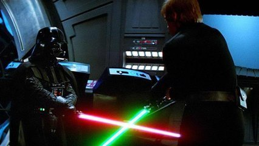

## L3 - Cabeças vão rolar




## Motivação

Um grupo de N amigos decidem brincar de um esporte sangrento. O vencedor leva a princesa bonita pra sua casa.  
Eles ficam em uma fila circular e escrevem em suas camisas números sequenciais onde o primeiro usa o número 1 e o último o número N.  
A mocinha vendada então diz um número entre 1 e N.  
O número escolhido pega a espada e decapita o companheiro da sua frente. Depois passa a espada para o próximo vivo que decapita o colega da frente.  
  
Assim continue até que só sobre um.  
Highlander Mode On!  
  
Dica: Não faça isso em casa.  
  
## Ação

Remova elementos intercaladamente em uma lista circular.  

**\*\*Simulação\*\***
  
Cinco pessoas e a princesa escolhe o 3.  
  
    1 2 3 4 5  : O 3 mata o 4 e a espada vai pro 5.  
    1 2 3 5     : O 5 mata o 1 e a espada vai pro 2.  
    2 3 5        : O 2 mata o 3 e a espada vai pro 5.  
    2 5           : O 5 mata o 2.  
    5  
  
Sobra o cinco.  
Dica: Não faça isso em casa.

### Entrada

*   O número N de participantes.  
*   O número X do participante que inicia o jogo.  

### Saída

*   O número do jogador vencedor.

## Exemplos

```
>>>>>>>>
5 
3
========
5
<<<<<<<<

>>>>>>>>
6
6
========
4
<<<<<<<<
```
