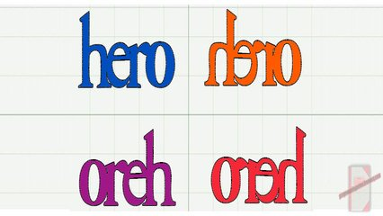

## #05_strings L1 - LP da Xura - Inverter String!




## Motivação

"ra on odnalor at acopip ed oriehc a acopip"

Tá ficando doido menino? Perguntou a mãe. Que marmota é essa que você tá fazendo com meu LP da Xuxa?

Mamãe, é que eu ví na internet que se tocarmos as músicas da Xuxa ao contrário saem umas mensagens sinistras!

## Ação

Ajude Carlinhos a testar essa teoria.  
Dado uma string, imprima a mesma string ao contrário.

### Entrada

*   Uma frase de até 100 caracteres.

### Saída

*   Imprima a frase ao contrario.

## Exemplos

```
>>>>>>>>
ra on odnalor at acopip ed oriehc o
========
o cheiro de pipoca ta rolando no ar
<<<<<<<<

>>>>>>>>
rahnos zaf em euq latsirc ed aul
========
lua de cristal que me faz sonhar
<<<<<<<<

>>>>>>>>
oacaroc ues on x mu ieuqram
========
marquei um x no seu coracao
<<<<<<<<
```
## Ajuda
#### Pseudocódigo
```
crie um vetor de char line com 100 espaços
leia line // use fgets em C
inicie um laço onde a = tamanho de line -2; enquanto a >=0; a--
    mostre line na posição a;
```
#