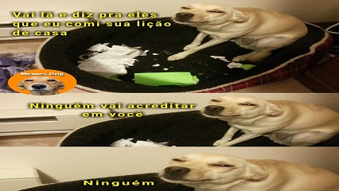

## #strings L2 - Meu cachorro comeu minha tarefa
### Retirar espaços



## Motivação

Joãozinho chega na escola com o trabalho digitado e a professora

Pergunta:  
\- Porque esse trabalho com esses espaços desse jeito?  
"briofitas  sao   plantas e    pteridofitas     sao dinossauros que     voam"

\- É que meu poodle bateu no espaço do meu notebook e agora ele tá doido, fessora.  
\- Mas, número 1, pteridófitas são plantas, pterodáctilos que são dinossauros. E número 2, eu não aceito mais desculpas de cachorros pra não entregar a lição de casa. A moda agora é cloud computing.

## Ação

Faça um código que retire os espaços duplicados que existem entre duas palavras.

### Entrada

*   Um texto(até 200 chars) com duas palavras e vários espaços entre elas.

### Saída

*   O menor valor inteiro.

## Exemplos

```
>>>>>>>>
galinha          pintadinha
========
galinha pintadinha
<<<<<<<<

>>>>>>>>
a    almofada
========
a almofada
<<<<<<<<

>>>>>>>>
comi    sorvete
========
comi sorvete
<<<<<<<<

>>>>>>>>
meteoro        pegasus
========
meteoro pegasus
<<<<<<<<
```

