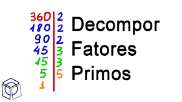

## #repetição L2 - Fatores de um número


## Ação
Leia um inteiro e mostre os fatores e a quantidade de vezes que eles aparecem na fatoração.


## Testes
```
>>>>>>>>
8
========
<<<<<<<<

>>>>>>>>
40
========
2 3
5 1
<<<<<<<<

>>>>>>>>
55
========
5 1
<<<<<<<<


>>>>>>>>
552
========
2 3
3 1
<<<<<<<<

>>>>>>>>
169400
========
2 3
5 2
7 1
11 2
<<<<<<<<

```