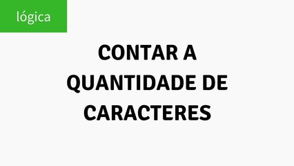

# Contar Ocorrências



Faça o código que conta quantas vezes um caractere aparece numa frase. Faça distinção entre maiúsculos e minúsculos. Cada frase tem até 100 caracteres.

### Entrada

* Uma frase de ate 100 caracteres e uma letra  

### Saída

* A quantidade de vezes que a letra aparece na frase

## Exemplos

<!-- load tests.toml --tests 2 -->
```py
>>>>>>>> INSERT
A Andreia alimentou a avestruz com alcaparras
a
======== EXPECT
8
<<<<<<<< FINISH
```

```py
>>>>>>>> INSERT
A Andreia alimentou a avestruz com alcaparras
A
======== EXPECT
2
<<<<<<<< FINISH
```
<!-- load -->
