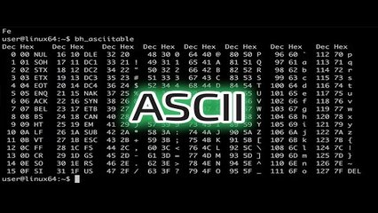

# Eribelton e a ascologia V1 - Somar Asc



Eribelton Fagundes estava passando na praça quando uma numeróloga lhe disse:

- Se você mudar seu nome para Erivelton Facundo, vai ficar mais bonito, inteligente e rico.

Ele não acreditando nisso, criou sua própria ciência, a ascologia. Na ascologia, para descobrir o poder de um nome, some o valor Asc de todos os caracteres e depois peque o resto da divisão por 50. Quanto menor o valor obtido, maior é o poder ascológico de um nome.

Receba um nome como entrada e some todos os caracteres. Imprima o resto da soma por 50.

### Entrada

- Um nome.  

### Saída

- Resto da divisão da soma dos caracteres por 50.  

## Exemplos

<!-- load tests.toml --tests 2 -->
```py
>>>>>>>> INSERT
David
======== EXPECT
38
<<<<<<<< FINISH
```

```py
>>>>>>>> INSERT
Scya
======== EXPECT
0
<<<<<<<< FINISH
```
<!-- load -->
