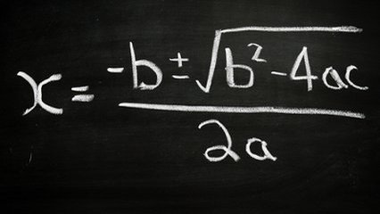

# Usando biblioteca matemática



Não sei se você amava ou odiava o tal do Bhaskara por inventar aquela fórmula das raízes. Agora é hora de implementar aquela conta pra nunca ter mais que fazer na mão.

Formula de bhaskara:

$$x = \frac{-b \pm \sqrt{\Delta}}{2a}$$

Cálculo do Delta:

$$\Delta = b^2 - 4ac$$

Dados os valores de A, B e C, calcule as raízes.

### Entrada

- Valores de A, B e C em ponto flutuante, um por linha.

### Saída

- Caso Δ seja positivo: exiba as duas raízes com duas casas decimais, uma em cada linha.
- Caso Δ seja igual a zero: exiba a única raiz com duas casas decimais.
- Caso Δ seja negativo: exiba a mensagem "nao ha raiz real".

## Exemplos

<!-- load tests.toml --tests 2 -->
```py
>>>>>>>> INSERT
5.4
25.0
-12.0
======== EXPECT
0.44
-5.07
<<<<<<<< FINISH
```

```py
>>>>>>>> INSERT
3.0
-7.0
4.0
======== EXPECT
1.33
1.00
<<<<<<<< FINISH
```
<!-- load -->
