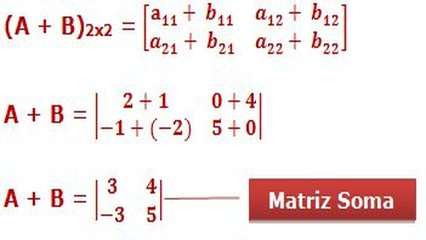

# Soma de elementos de em uma matriz



## Contexto

- Mamãe me perguntou: Tem certeza que tu não tá escondendo alguma nota baixa?
- Tudo deu 10 no meu boletim, mãe!
- Como assim, tudo deu 10?
- Matemática 3, Português 4, Ciências 2, História 1, Geografia 0, Inglês 0. Somando dá 10!

Sua tarefa é criar um programa que, inspirando-se nessa lógica, receba uma matriz 2x3 de notas inteiras e retorne a soma de todos os seus elementos.

### Entrada

- Uma matriz 2x3 de números inteiros. Cada linha da matriz será fornecida em uma nova linha de entrada, com os números separados por espaços.

### Saída

- A soma de todos os valores da matriz.

### Restrições

- A matriz de entrada será sempre do tamanho 2x3.

### Testes

``` py
>>>>>>>> INSERT
1 2 3
4 5 6
======== EXPECT
21
<<<<<<<< FINISH
```

```py
>>>>>>>> INSERT
1 1 1
1 1 1
======== EXPECT
6
<<<<<<<< FINISH
```

```py
>>>>>>>> INSERT
5 2 1
3 2 1
======== EXPECT
14
<<<<<<<< FINISH
```
