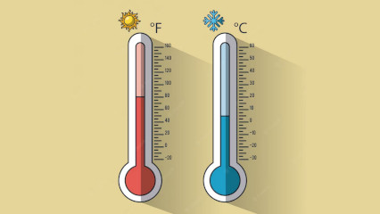

# Conversor para Fahrenheit



## Contexto

Implemente um programa que recebe a temperatura em graus Celsius e converte para Fahrenheit. O valor fornecido será fracionário (double).

$$T_f = 1.8 \cdot T_c + 32$$

### Entrada

- Temperatura em Celsius  

### Saída

- O valor correspondente em Fahrenheit, com 6 casas decimais.

## Testes

```py
>>>>>>>> INSERT
43.000000
======== EXPECT
109.400000
<<<<<<<< FINISH
```

```py
>>>>>>>> INSERT
55.000000
======== EXPECT
131.000000
<<<<<<<< FINISH
```

## Dicas

### Programando em: C

- Utilize o especificador de formato `%.6f` na função `printf`. O número **6** após o ponto indica a quantidade de casas decimais a serem exibidas:

```c
int main() {
    double resultado;
    printf("%.6f\n", resultado);
}
```

### Programando em: Go

- Utilize o formato `%.6f` dentro da função `fmt.Printf`. O número **6** após o ponto indica o número de casas decimais que serão exibidas:

```go
fmt.Printf("%.6f\n", resultado)
```

### Programando em: Python

- Utilize o formato `:.6f` dentro da função `print` suando f-strings. O número **6** após o ponto indica o número de casas decimais que serão exibidas:

``` python
print(f"{resultado:.6f}")
```


### Programando em: TypeScript

- Para exibir um número com seis casas decimais em TypeScript, utilize o método `toFixed(6)` do objeto `Number`. O número **6** especifica a quantidade de casas decimais que serão exibidas após o ponto decimal:

```ts
console.log(`${resultado.toFixed(6)}`);
```
