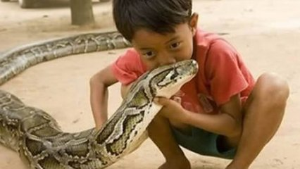
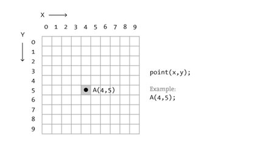

# Jogo da cobrinha



## Contexto

Marivaldo, mais conhecido como Zé da Carroça, é um agricultor bem sucedido do sertão de Quixadá. Só quando chove é claro. Mas o problema de Marivaldo é outro. Seu filho mais novo, Mavarildo, mais conhecido como Zezim da Carroça, tem uma fixação assustadora em bichos do mato, em especial cobras. O menino ajudado pelo seu irmão Marivanio vara o cercado procurando uma cobra pra bater uma foto no celular do pai e postar nas redes sociais para seus seguidores. O menino entretanto combinou com o pai que se ele ganhasse um celular com joguinhos, ele pararia de tal estripulias. O pai, então, por fraqueza, cedendo à chantagem, comprou um nokia 3310 super conservado na feirinha do centro pela bagatela de uma raspa de rapadura com coco e mamão num prato de coalhada.

O primeiro jogo que Mavarildo instalou foi o jogo da cobrinha. Mas ele é distraído. No meio do jogo, olha pro horizonte e passa vários segundo pensando em cascavéis, pítons e outros bichos. Enquanto, isso, a cobrinha no seu celular vai andando, andando, andando, fazendo loops na tela.

No jogo da cobrinha, quando a cabeça passa do limite direito, ela reaparece do lado esquerdo. Quando passa do limite inferior, reaparece na parte de cima. Imagine o jogo apenas com a cabeça da cobra. A tela é quadrada, formada por N quadrados de largura e N quadrados de altura. O quadrado de posição 0, 0 é o mais em cima na esquerda. O X cresce para direita e o Y para baixo de acordo com a seguinte figura.



A cabeça da cobra pode estar apontada para 4 possíveis direções.

```txt
U Up   (Cima)
D Down (Baixo)
L Left (Esquerda)
R Right (Direita)
```

Mavarildo se distrai por S segundos. Imagine que cada segundo, a cabeça da cobra se move 1 posição. Você deve fazer um código que calcule a posição da cabeça da cobra dada a dimensão do tabuleiro N, a posição inicial X, Y, a direção da cabeça C e a quantidade de segundos S que Mavarildo passa distraído.

### Entrada

- A entrada consiste de 5 linhas:
  - 𝑁: Um número inteiro que indica a dimensão do tabuleiro.
  - 𝑋: Um número inteiro representando a posição inicial horizontal da cabeça da cobra.
  - 𝑌: Um número inteiro representando a posição inicial vertical da cabeça da cobra.
  - 𝐶: Um caractere representando a direção da cobra ('U' para cima, 'D' para baixo, 'L' para esquerda, 'R' para direita).
  - 𝑆: Um número inteiro representando o número de segundos de distração.

### Saída

- O programa deve imprimir duas coordenadas inteiras 𝑋 e 𝑌, indicando a posição final da cabeça.

### Restrições

- 0 ≤ N ≤ 1000
- 0 ≤ X ≤ 1000
- 0 ≤ Y ≤ 1000
- 0 ≤ C ≤ 1000
- 0 ≤ S ≤ 1000

## Testes

```py
>>>>>>>> INSERT
10
4
3
R
1
======== EXPECT
5 3
<<<<<<<< FINISH
```

```py
>>>>>>>> INSERT
10
4
3
R
8
======== EXPECT
2 3
<<<<<<<< FINISH
```

```py
>>>>>>>> INSERT
10
4
5
U
1
======== EXPECT
4 4
<<<<<<<< FINISH
```

## Dicas

Ajuda
A cobra se move uma unidade por segundo na direção indicada. Quando ultrapassa o limite do tabuleiro, ela reaparece do outro lado. Você pode calcular a nova posição usando operações de módulo para garantir que a posição fique dentro dos limites do tabuleiro.

Você pode resolver o problema utilizando as seguintes operações:

- Para mover para a direita ou esquerda, modifique a coordenada 𝑋 e aplique o operador módulo 𝑁 para "dar a volta" quando necessário.
- Para mover para cima ou para baixo, modifique a coordenada 𝑌 e aplique o mesmo princípio de módulo.
