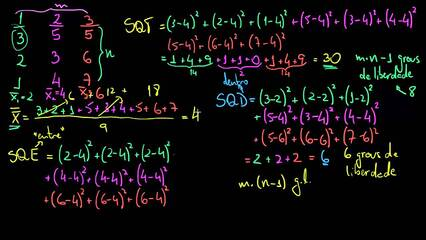

# Qual a coluna de maior valor



## Contexto

Ygor está trabalhando em sua matriz nesse exato momento! Ele quer saber qual coluna tem o maior valor. O valor de uma coluna é dado pela **soma dos quadrados (n²)** dos seus elementos.

Sua tarefa é criar um programa que, dada uma matriz quadrada, determine qual coluna possui o maior valor de acordo com essa regra.

**Exemplo:**
Para a matriz abaixo:

```py
4 2 2
3 1 3
2 0 3
```

O valor da coluna 0 é `4² + 3² + 2² = 16 + 9 + 4 = 29`. Após calcular para todas as colunas, a de maior valor seria a coluna 0.

### Entrada

- A primeira linha contém um número inteiro **N**, o tamanho da matriz.
- As **N** linhas seguintes contêm os **N** elementos de cada linha da matriz, separados por espaços.

### Saída

- O índice da coluna que possui o maior valor.

### Restrições

- Se duas ou mais colunas tiverem o mesmo valor máximo, retorne o índice da primeira que foi encontrada.

### Testes

``` py
>>>>>>>> INSERT Teste 0
3
3 4 5
6 8 9
0 6 7
======== EXPECT
2
<<<<<<<< FINISH
```

```py
>>>>>>>> INSERT Teste 1
3
-7 8 10
9 2 5
6 3 5
======== EXPECT
0
<<<<<<<< FINISH
```

```py
>>>>>>>> INSERT Teste 2
5
3 3 3 3 4
5 6 4 8 9
2 2 1 3 7 
-5 5 4 6 4
2 3 1 0 8 10
======== EXPECT
4
<<<<<<<< FINISH
```
