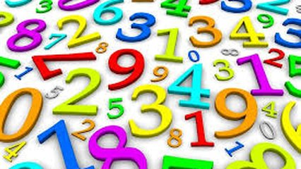

# Jogo de laço



Um jogo de concentração muito antigo consiste em fazer contagem simultânea entre dois números. O primeiro número cresce, enquanto o segundo número diminui, até que ambos troquem de posição.

Por exemplo, se os números iniciais forem 1 e 10, a sequência seria:

```py
1 10 2 9 3 8 4 7 5 6 6 5 7 4 8 3 9 2 10 1
```

Esse padrão força o jogador a manter a concentração e lembrar-se das mudanças em ambas as direçõe

Dados dois número **A** e **B**, com **A** sempre menor que ***B**, gere a sequencia que o jogador deve realizar.

### Entrada

- Dois números inteiros **A** e **B**, sendo **A** menor que **B**.

### Saída

- A sequência completa conforme a regra do jogo, apresentada entre colchetes, separada por espaços.

## Exemplos

<!-- load tests.toml --tests 3 -->
```py
>>>>>>>> INSERT
1 10
======== EXPECT
[ 1 10 2 9 3 8 4 7 5 6 6 5 7 4 8 3 9 2 10 1 ]
<<<<<<<< FINISH
```

```py
>>>>>>>> INSERT
1 5
======== EXPECT
[ 1 5 2 4 3 3 4 2 5 1 ]
<<<<<<<< FINISH
```

```py
>>>>>>>> INSERT
2 7
======== EXPECT
[ 2 7 3 6 4 5 5 4 6 3 7 2 ]
<<<<<<<< FINISH
```
<!-- load -->


## Resolução

### Em C

- [Vídeo](https://youtu.be/L9FmHLc87uw)
