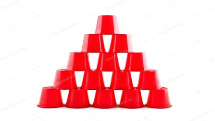

# Quebrador de copos



A brincadeira preferida de Maurício é pegar os copos da sua mãe e fazer uma torre no formato de um triangulo isósceles. Um dia, sua mãe entrou na cozinha e viu aquela torre de base 5 utilizando 15 copos. Imediatamente uma chinela voou pela casa acertando em cheio. A cabeça de Maurício é claro, pra aprender a não fazer torres com copos de vidro.


Faça um programa que dado um numero N inteiro (0<N<50) mostre na tela um triangulo isósceles formado por apenas N e com altura igual a N.

### Entrada

* Inteiro N (0<N<50)

### Saída

* Um triângulo isósceles formado por apenas pelo numero N e com altura igual a N.

## Exemplos

<!-- load tests.toml --tests 2 -->
```py
>>>>>>>> INSERT
3
======== EXPECT
..3..
.3.3.
3.3.3
<<<<<<<< FINISH
```

```py
>>>>>>>> INSERT
2
======== EXPECT
.2.
2.2
<<<<<<<< FINISH
```
<!-- load -->
