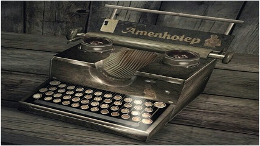

# Máquina Quebrada



## Contexto

Durante anos, todos os contratos da Associação de Contratos da Modernolândia (ACM) foram datilografados em uma velha máquina de datilografia. Recentemente, o Sr. Miranda, um dos contadores, percebeu que a máquina apresentava uma falha em um, e apenas um, dos dígitos numéricos. Quando o dígito falho é datilografado, ele simplesmente não é impresso na folha.

Preocupado com a contabilidade, ele quer saber quais os valores reais que foram registrados nos contratos. Por exemplo, se a falha for no dígito **5**, o valor **1500** seria datilografado como **100**. Note que o Sr. Miranda quer o valor numérico final, ou seja, se o número **5000** fosse digitado, o resultado seria **0**, e não "000".

Sua tarefa é criar um programa que, dado o dígito da tecla quebrada e o número original, imprima o valor que de fato foi representado no contrato.

### Entrada

- A primeira linha contém um dígito (de 1 a 9) representando a tecla quebrada.
- A segunda linha contém o número que foi negociado inicialmente.

### Saída

- Uma linha contendo um único inteiro, o valor numérico que foi de fato representado no contrato.

### Restrições

- O dígito da tecla quebrada estará entre **1** e **9**.
- O número negociado pode ter até **100** dígitos.

## Testes

``` py
>>>>>>>> INSERT
5
5000000
======== EXPECT
0
<<<<<<<< FINISH
```

```py
>>>>>>>> INSERT
5
5004000
======== EXPECT
4000
<<<<<<<< FINISH
```

```py
>>>>>>>> INSERT
3
123456
======== EXPECT
12456
<<<<<<<< FINISH
```

```py
>>>>>>>> INSERT
9
99999999991999999
======== EXPECT
1
<<<<<<<< FINISH
```

```py
>>>>>>>> INSERT
7
777
======== EXPECT
0
<<<<<<<< FINISH
```
