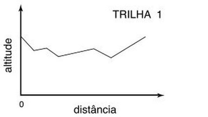

# Trila Modo fácil - OBI 2005



Uma trilha é descrita como um conjunto de alturas representando os trechos de subidas e descidas. Considere que apenas existe esforço para os trechos onde existem subidas e que descer não realiza esforço. Uma trilha pode ser percorrida em qualquer sentido.

Por exemplo, seja a trilha de 6 pontos a seguir.

```py
300 305 301 299 290 295
```

Se ela for percorrida no sentido esquerda direita vai gastar 10 de esforço:

- 5 no trecho 1 : (305 - 5)
- 0 no trecho 2
- 0 no trecho 3
- 0 no trecho 4
- 5 no trecho 5 : (295 - 5)

Se ela for percorrida no sentido contrário vai gastar 14 de esforço. Então o melhor esforço da trilha é 10.

Dado uma trilha, você deve calcular o menor esforço para percorrê-la.
  
### Entrada

- A descrição de uma trilha inicia com um número inteiro M que indica a quantidade de pontos de medição da trilha (2 ≤ M ≤ 1000), seguido de M números inteiros Hi, um por linha, representando a altura dos pontos da trilha (medidos a intervalos regulares e iguais para todas as linhas).
- Pode-se percorrer a trilha em qualquer sentido (ou seja, partindo do ponto de altitude H1 em direção ao ponto de altitude HM , ou partindo do ponto de altitude HM em direção ao ponto de altitude H1 ).
  
### Saída

- Seu programa deve produzir uma única linha na saı́da, contendo um número inteiro representando o esforço pra percorrer a trilha.

## Restrições

- 2 ≤ M ≤ 1000  
- 0 ≤ Hi ≤ 1000

## Exemplos

<!-- load tests.toml --tests 2 -->
```py
>>>>>>>> INSERT
6
300
305
301
299
290
295
======== EXPECT
10
<<<<<<<< FINISH
```

```py
>>>>>>>> INSERT
2
236
605
======== EXPECT
0
<<<<<<<< FINISH
```
<!-- load -->
