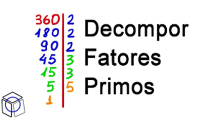

# Fatoração de um número



Dado um número inteiro, o objetivo é encontrar seus fatores primos e a quantidade de vezes que cada fator aparece na sua fatoração e montar um vetor com os fatores.

Crie uma função que retorna um mapa onde a chave é o fator primo e o valor é a quantidade de vezes que ele aparece.

```go
def calc_fatores(num int) map[int]int {
    ...
}
```

### Entrada

- Um número inteiro **N**.

### Saída

- Os fatores primos de **N** e a quantidade de vezes que eles aparecem na fatoração. Cada fator e sua quantidade devem ser impressos em uma linha, com o fator seguido pelo número de vezes que aparece.

## Exemplos

<!-- load tests.toml --tests 2 -->
```py
>>>>>>>> INSERT
8
======== EXPECT
2 3
<<<<<<<< FINISH
```

```py
>>>>>>>> INSERT
40
======== EXPECT
2 3
5 1
<<<<<<<< FINISH
```
<!-- load -->
