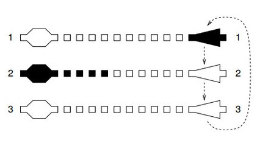

# Game10 - OBI 2017 - Fase 1 - Universitário


## Contexto

No princípio dos anos 1980 surgiram nos colégios os primeiros relógios de pulso digitais com joguinhos. Era uma febre entre os alunos e quem tinha um era muito popular na hora do recreio. Os joguinhos eram bem simples, mas muito legais. Um dos primeiros era o Game-10, no qual você controlava um avião que aparecia na parte direita do visor. Na parte esquerda aparecia um disco voador em qualquer uma de três posições, aleatoriamente, e lançava um míssil. O objetivo do jogador era movimentar o avião verticalmente para que ficasse na frente do disco voador (na mesma linha horizontal, do lado direito) e atirar para interceptar o míssil antes que esse atingisse o avião.



Como o movimento do avião era feito com apenas um botão, só dava para movimentar em um sentido: ao apertar o botão sucessivas vezes, o avião se movia na sequência de posições ... 1 → 2 → 3 → 1 → 2 → 3 → 1 ...

Veja que, na situação da figura, o jogador deveria apertar o botão apenas uma vez, para ir da posição 1 para a posição 2, e conseguir atirar e interceptar o míssil.

Neste problema vamos considerar que existem N posições e não apenas três. Dado o número de posições N, a posição D na qual o disco voador aparece, e a posição A onde está o avião, seu programa deve computar o número mínimo de vezes que o jogador precisa apertar o botão para movimentar o avião até a mesma posição do disco voador e poder atirar!

### Entrada

- A entrada é composta por três linhas:
  - Um número inteiro 𝑁 representando o número de posições no jogo.
  - Um número inteiro 𝐷 representando a posição do disco voador.
  - Um número inteiro 𝐴 representando a posição atual do avião.

### Saída

- Seu programa deve imprimir uma linha contendo um inteiro, o número mínimo de vezes que o jogador deve apertar o botão para poder atirar.

### Restrições

- 3 ≤ N ≤ 100
- 1 ≤ D,A ≤ N

## Testes

``` py
>>>>>>>> INSERT
3
2
1
======== EXPECT
1
<<<<<<<< FINISH
```

```py
>>>>>>>> INSERT
20
8
13
======== EXPECT
15
<<<<<<<< FINISH
```

```py
>>>>>>>> INSERT
3
2
2
======== EXPECT
0
<<<<<<<< FINISH
```

## Dicas

O problema pode ser resolvido calculando a diferença cíclica entre a posição do disco voador 𝐷 e a posição do avião 𝐴. A diferença pode ser obtida de duas maneiras:

- Movendo o avião de 𝐴 até 𝐷 diretamente.
- Dando uma volta completa no ciclo e contando quantos movimentos são necessários.

O número de movimentos será o menor valor entre essas duas possibilidades.

O número de movimentos necessários para mover o avião pode ser calculado com a fórmula:

$$movimentos = (D - A + N) \mod N$$

Isso garante que a contagem dos movimentos seja sempre positiva e dentro do intervalo das posições disponíveis.
