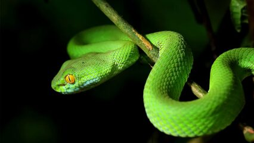

# Gomos da cobrinha



## Contexto

Sua tarefa é simular o movimento de uma cobra em um plano 2D. A cobra é composta por vários "gomos" ou segmentos. A cada passo, a cabeça da cobra se move uma unidade na direção especificada (Cima, Baixo, Esquerda, Direita), e cada gomo subsequente ocupa a posição anterior do gomo que estava à sua frente, criando o clássico movimento de rastro.

### Entrada

- A primeira linha contém um inteiro **Q**, a quantidade de gomos da cobra, e um caractere **D**, a direção do movimento ('L' para esquerda, 'R' para direita, 'U' para cima, 'D' para baixo).
- As **Q** linhas seguintes contêm a posição **x** e **y** de cada gomo, começando pela cabeça.

### Saída

- As posições atualizadas de cada gomo após a cobra andar uma posição, com cada posição (x y) em uma nova linha.

### Restrições

- O eixo **x** aumenta para a direita.
- O eixo **y** aumenta para baixo.

### Testes

``` py
>>>>>>>> INSERT
1 L
5 5
======== EXPECT
4 5
<<<<<<<< FINISH
```

```py
>>>>>>>> INSERT
3 L
5 5
6 5
6 6
======== EXPECT
4 5
5 5
6 5
<<<<<<<< FINISH
```

```py
>>>>>>>> INSERT
4 U
5 5
6 5
6 6
6 7
======== EXPECT
5 4
5 5
6 5
6 6
<<<<<<<< FINISH
```

```py
>>>>>>>> INSERT
1 R
5 5
======== EXPECT
6 5
<<<<<<<< FINISH
```

```py
>>>>>>>> INSERT
1 D
5 5
======== EXPECT
5 6
<<<<<<<< FINISH
```

```py
>>>>>>>> INSERT
1 U
5 5
======== EXPECT
5 4
<<<<<<<< FINISH
```