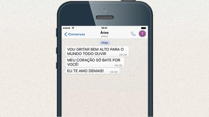

# Invertendo o Case da frase



## Contexto

- "Meu filho, você não sabe que quando a gente escreve tudo em caixa alta é como se a gente tivesse gritando?"

- "Sabia não."
- "Como assim não sabia, sua mãe não é professora de informática?"
- "É. E ela não lhe ensinou o básico sobre etiqueta na internet?"
- "Não."
- "Eu vou falar com sua mãe então."
- "Tia, aproveita e pede pra ela não usar caixa alta quando eu mostrar o boletim pra ela."

Sua tarefa é criar um programa que, dado um texto, troque o "case" de cada letra. O que for minúsculo deve ser impresso em maiúsculo, e o que for maiúsculo deve ser impresso em minúsculo. Números e pontuação devem permanecer inalterados.

### Entrada

- Um texto de até **100** caracteres.

### Saída

- O texto com o case de cada letra invertido.

### Restrições

- O texto terá no máximo **100** caracteres.
- Números e símbolos de pontuação não devem ser alterados.

## Testes

``` py
>>>>>>>> INSERT
O ovomaltine e GOSTOSO
======== EXPECT
o OVOMALTINE E gostoso
<<<<<<<< FINISH
```

```py
>>>>>>>> INSERT
Paralelepipedarte-ei se NAO me passar a CARTEIRA
======== EXPECT
pARALELEPIPEDARTE-EI SE nao ME PASSAR A carteira
<<<<<<<< FINISH
```

```py
>>>>>>>> INSERT
1, Dois, 3 Indiozinhos
======== EXPECT
1, dOIS, 3 iNDIOZINHOS
<<<<<<<< FINISH
```
