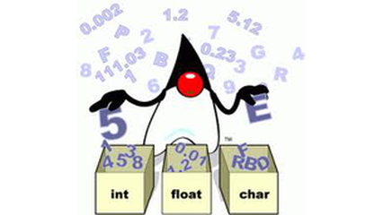

# Identificando tipos



## Contexto

Sua tarefa é criar um programa que analise uma frase e identifique o tipo de cada "palavra" ou elemento contido nela. Você deve classificar cada elemento como **str**, **int** ou **float**, seguindo um conjunto de regras específicas.

Regras de Classificação:

- **str:** Se o elemento contiver pelo menos uma letra.
- **float:** Se o elemento for um número e contiver um ponto (`.`).
- **int:** Se o elemento for um número e não contiver um ponto.
- Números (int e float) podem ser negativos.

### Entrada

- Uma frase com palavras (letras minúsculas), números, espaços e pontos.

### Saída

- Uma linha contendo o tipo de cada elemento da frase ("str", "float" ou "int"), separado por espaços.

### Restrições

- A frase terá no máximo **100** caracteres.
- Cada palavra/elemento terá no máximo **10** caracteres.

### Testes

``` py
>>>>>>>> INSERT 01
tenho 15 4nos 1.75 altur4 -15 conto p0rr4 -4.04
======== EXPECT
str int str float str int str str float
<<<<<<<< FINISH
```

```py
>>>>>>>> INSERT 02
a proxima eleição presidencial no Brasil ocorrerá em 2 de outubro de 2018
======== EXPECT
str str str str str str str str int str str str int
<<<<<<<< FINISH
```

<!--
>>>>>>>> INSERT 03
aa 1 -2.0
======== EXPECT
str int float
<<<<<<<< FINISH
```

```py
>>>>>>>> INSERT 04
02a -x1 -4.b54 p0
======== EXPECT
str str str str
<<<<<<<< FINISH
```

```py
>>>>>>>> INSERT 05
-pato -40 -5.4
======== EXPECT
str int float
<<<<<<<< FINISH
```

```py
>>>>>>>> INSERT 06
02 -1 -4.54 p0
======== EXPECT
int int float str
<<<<<<<< FINISH
-->
