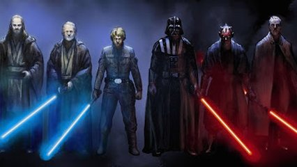

# Cabo de Guerra



Um grupo de Jedis e Siths resolveram decidir de uma fez qual lado da força é o mais forte, então eles resolveram realizar uma competição de cabo de guerra para colocarem seus poderes a prova.


Você recebe uma entrada que é um vetor de tamanho T de numeros positivos entre 1 e 10. (T, sempre par, entre 0 e 50). O valor do número representa a força do participante. A primeira metade do vetor representa os participantes do lado Jedi. A segunda metade do vetor representa os participantes do lado Sith. Analise o vetor somando a força dos participantes e escreva o nome do lado que ganhou ou empate ("Jedi", "Sith", "Empate").

### Entrada

* 1ª linha: número de elementos
* Próximas linhas: valor dos elementos.

### Saída

* "Jedi", "Sith", ou "Empate"

## Exemplos

<!-- load tests.toml --tests 2 -->
```py
>>>>>>>> INSERT
2
1
1
======== EXPECT
Empate
<<<<<<<< FINISH
```

```py
>>>>>>>> INSERT
2
2
1
======== EXPECT
Jedi
<<<<<<<< FINISH
```
<!-- load -->
