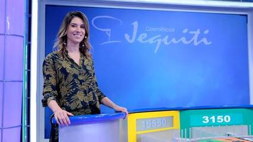

# Roda Roda Jequiti



Faça um código que simule o comportamento do jogo da forca.  
Você recebe como parâmetro a palavra real e todos as letras que já foram chutadas pelo participante e deve retornar a palavra cifrada a ser apresentada pelo programa. Nas letras não acertadas ainda, você deve colocar o caractere marcador passado por parâmetro.

Se nas palavras houver pontuação ou espaço, você deve imprimi-los corretamente. Se a letra for maiúscula, você deve imprimir maiúscula.

### Entrada

* Frase(max 100 char),
* Chutes (max 26 char)
* Caractere de marcação (1 char).

### Saída

* Uma frase com as letras chutadas corretamente e o caractere marcador nas letras erradas.

## Exemplos

<!-- load tests.toml --tests 2 -->
```py
>>>>>>>> INSERT
extraordinario
aeioubcdfgh
*
======== EXPECT
e***ao*di*a*io
<<<<<<<< FINISH
```

```py
>>>>>>>> INSERT
Teco-Teco!
tbxyan
_
======== EXPECT
T___-T___!
<<<<<<<< FINISH
```
<!-- load -->
