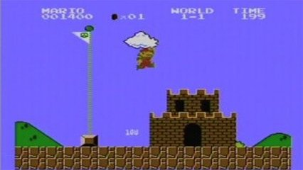

# Mário e o Assassins Creed

## Lendo cenário



## Contexto

Thaiquovisqui da Silva está fazendo um joguinho com uma mistura de Super Mário e Assassins Creed. Nele, o Mário anda em um cenário 2D, mas ao invés de pular na cabeça dos inimigos, ele os derrota com uma chave de fenda. Afinal, Mário é um encanador, então faz todo o sentido!

Sua tarefa é ajudar a construir os cenários para este jogo. Você receberá um vetor de números inteiros que representa a altura dos blocos em cada coluna do cenário. Seu programa deve desenhar esse cenário na tela, usando o caractere **#** para representar os blocos e **\_** para os espaços vazios.

```py
_#__
_#_#
####
```

E o vetor 1133464221 seria como o seguinte cenário:

```py
_____#____
_____#____
____###___
__#####___
__#######_
##########
```

### Entrada

- A primeira linha contém um número inteiro **N** (1 ≤ N ≤ 20), representando a quantidade de elementos no vetor.
- A segunda linha contém N números inteiros, separados por espaços, representando as alturas dos blocos (cada número entre 1 e 20).

### Saída

- O cenário correspondente ao vetor de entrada, representado por **\_** e **#**.

### Restrições

- O vetor terá entre **1** e **20** elementos.
- Cada número no vetor (altura) estará entre **1** e **20**.

### Testes

``` py
>>>>>>>> INSERT
4
1 3 1 2
======== EXPECT
_#__
_#_#
####
<<<<<<<< FINISH
```

```py
>>>>>>>> INSERT
5
1 3 1 2 5
======== EXPECT
____#
____#
_#__#
_#_##
#####
<<<<<<<< FINISH
```

```py
>>>>>>>> INSERT
10
1 1 3 3 4 6 4 2 2 1
======== EXPECT
_____#____
_____#____
____###___
__#####___
__#######_
##########
<<<<<<<< FINISH
```
