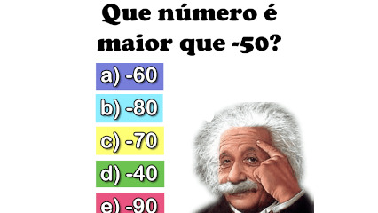

# Valor máximo entre dois números



## Ação

Implemente um programa que recebe dois números inteiros e imprime o maior.

### Entrada

- Dois inteiros

### Saída

- Imprima o maior número

## Testes

```py
>>>>>>>> INSERT 0
4
9
======== EXPECT
9
<<<<<<<< FINISH
```

```py
>>>>>>>> INSERT 1
56
7
======== EXPECT
56
<<<<<<<< FINISH
```
