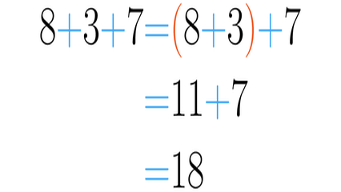

# Encontrando e somando



Dada uma frase(max 100 char) com palavras(letras minusculas), números e espaço, some todos os números que encontrar. Numa palavra existem apenas números ou apenas alfabéticos. Palavras são separadas por 1 espaço.

### Entrada

* Uma frase(max 100 char) com palavras (letras minusculas), números e espaço.

### Saida

* o somatório dos numeros.

## Exemplos

<!-- load tests.toml --tests 2 -->
```py
>>>>>>>> INSERT
apesar de 2 jogadores serem expulsos, a seleção brasileira venceu a seleção italiana por 5 x 1
======== EXPECT
8
<<<<<<<< FINISH
```

```py
>>>>>>>> INSERT
meus 3 cachorros comeram 2 ratos em 11 horas
======== EXPECT
16
<<<<<<<< FINISH
```
<!-- load -->
