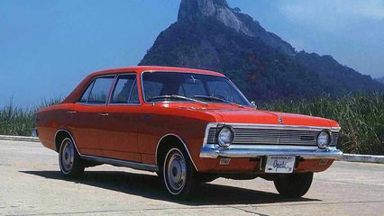

# Opala bebedor



Um amigo lhe deu a velocidade média do carro dele em km/h, o tempo da viagem em minutos e o consumo de combustível em litros. Sua tarefa é criar um programa que calcule o desempenho do motor em km por litro.

Para isso, siga os seguintes passos:

- Converta o tempo de minutos para horas (tempo em horas = tempo em minutos / 60).
- Calcule a distância percorrida (distância = velocidade * tempo em horas).
- Calcule o desempenho final (desempenho = distância / consumo).

### Entrada

- Três números, um por linha:
  - Velocidade média em km/h.
  - Tempo da viagem em minutos.
  - Consumo de combustível em litros.

### Saída

- O desempenho do motor em km/l, com duas casas decimais.

### Restrições

- Os valores de entrada (velocidade, tempo, consumo) serão números positivos.
- O consumo será sempre maior que zero.

## Exemplos

<!-- load tests.toml --tests 2 -->
```py
>>>>>>>> INSERT
100
60
10
======== EXPECT
10.00
<<<<<<<< FINISH
```

```py
>>>>>>>> INSERT
60
40
10
======== EXPECT
4.00
<<<<<<<< FINISH
```
<!-- load -->

### Resolução

[Explicação](https://youtu.be/d0nlVzjtMBE)
