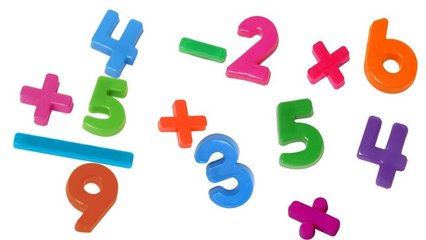
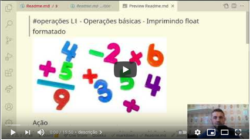

# Operações básicas



## Contexto

Sua tarefa é criar um programa que leia dois números inteiros e imprima o resultado das cinco operações básicas: soma, subtração, multiplicação, divisão e o resto da divisão, nesta ordem.

### Entrada

- Dois valores inteiros, **A** e **B**, um por linha.

### Saída

- A saída deve conter 5 linhas, cada uma com o resultado de uma operação:
  - Soma **(A + B)**
  - Subtração **(A - B)**
  - Multiplicação **(A * B)**
  - Divisão **(A / B)**
  - Resto da Divisão **(A % B)**

### Restrições

- O valor da divisão deve ser impresso como um número de ponto flutuante com duas casas decimais.
- O valor de **B** nunca será 0.

## Testes

``` py
>>>>>>>> INSERT
1
4
======== EXPECT
5
-3
4
0.25
1
<<<<<<<< FINISH
```

```py
>>>>>>>> INSERT
3
3
======== EXPECT
6
0
9
1.00
0
<<<<<<<< FINISH
```

### Dica

Seja a variável `valor` um número em ponto flutuante, você pode imprimir essa variável com duas casas decimais você pode fazer assim:

- C: `printf("%2.f", valor)`
- Javascript: `console.log(valor.toFixed(2))`
- Python: `print("{:.2f}".format(valor))`

### Resolução

[](https://youtu.be/XbjHzCULmEI)
