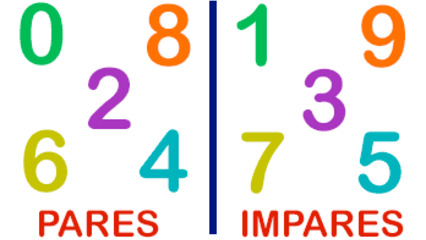

# Par ou impar



Implemente um programa que recebe um número inteiro e diga se ele é par ou impar.

### Entrada

- Um inteiro

### Saída

- "PAR" se o número for impar
- "IMPAR" se o número for par

## Exemplos

<!-- load tests.toml --tests 2 -->
```py
>>>>>>>> INSERT
3
======== EXPECT
IMPAR
<<<<<<<< FINISH
```

```py
>>>>>>>> INSERT
12
======== EXPECT
PAR
<<<<<<<< FINISH
```
<!-- load -->
