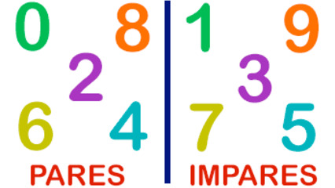

# L0 - @par ou impar



## Ação

Implemente um programa que recebe um número inteiro e diga se ele é par ou impar.

### Entrada

- Um inteiro

### Saída

- "PAR" se o número for impar
- "IMPAR" se o número for par

## Exemplos

```txt
#INPUT 0
3
#OUTPUT
IMPAR
#END

#INPUT 1
12
#OUTPUT
PAR
#END

#INPUT 2
33
#OUTPUT
IMPAR
#END

#INPUT 3
0
#OUTPUT
PAR
#END

#INPUT 4
7
#OUTPUT
IMPAR
#END

#INPUT 5
20
#OUTPUT
PAR
#END

#INPUT 6
15
#OUTPUT
IMPAR
#END
```
