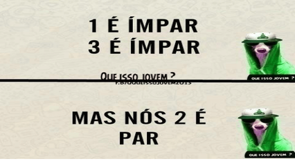

# Calculando soma



Dado dois números inteiros **A** e **B**, some todos os números inteiros pares que estão entre **A** e **B**, inclusive **A** e **B**.

### Entrada

- Dois números inteiros **A** e **B**, sendo **B** maior ou igual a **A**.

### Saída

- A soma de todos os números pares entre **A** e **B**, inclusive **A** e **B**.
- Se **A** for maior que **B**, imprima **"invalido"**.

## Exemplos

<!-- load tests.toml --tests 2 -->
```py
>>>>>>>> INSERT
1
10
======== EXPECT
30
<<<<<<<< FINISH
```

```py
>>>>>>>> INSERT
1
5
======== EXPECT
6
<<<<<<<< FINISH
```
<!-- load -->
