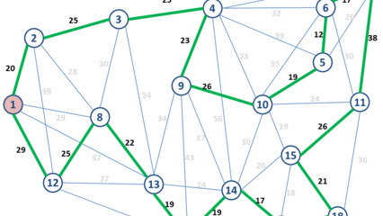

# Pontos como structs



Considere o seguinte tipo de registro que deve ser usado em seu programa:

```C
typedef struct{
     float x; 
     float y;
}Ponto;
```

Implemente um função que recebe n pontos distintos e um `Ponto p` e devolva o ponto mais próximo de p entre os n pontos distintos. A função tem o seguint protótipo:

```c
Ponto proximo(Ponto vetor[], int n, Ponto p);
```

Dica: Para isso, implemente uma função que recebe dois pontos e calcule a distância entre esse dois pontos.

```c
float distancia(Ponto p1, Ponto p2);
```

O programa principal é o seguinte:

```c
#include <stdio.h>
#include <math.h>

typedef struct {
    float x,y;
} Ponto;

Ponto proximo(Ponto vetor[], int n, Ponto p);

int main(){
    
    Ponto p = {2,4};
    Ponto vet[] = { {3,6}, {1,6}, {5,7}, {3,9}, {4,9} };
    Ponto q = proximo(vet, 5, p);
    printf("%.2f %.2f\n", q.x, q.y); //3.00 6.00 
}
```

## Exemplos

<!-- load tests.toml --tests 2 -->
```py
>>>>>>>> INSERT
2 4
5
3 6
1 6
5 7
3 9
4 9
======== EXPECT
3.00 6.00
<<<<<<<< FINISH
```

```py
>>>>>>>> INSERT
2.9 4.8
5
71.8 6.6
10 66.3
9.6 7.6
30.9 9.66
4.6 9.7
======== EXPECT
4.60 9.70
<<<<<<<< FINISH
```
<!-- load -->
