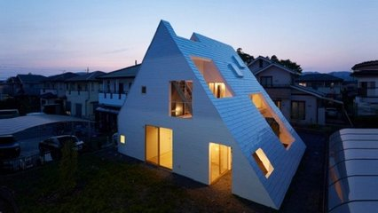
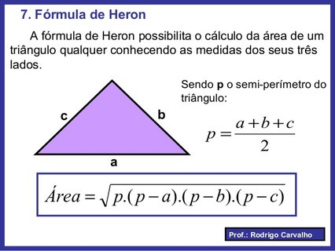

# Pintando a casa



Fernando comprou uma casa triangular. Ao tentar calcular a quantidade de tinta necessária para pintar as paredes, ele percebeu que precisava saber como calcular a área de um triângulo. Felizmente, ele encontrou a Fórmula de Heron, que permite calcular a área de um triângulo a partir do tamanho de seus lados.

Implemente um programa que, dado o tamanho dos três lados de um triângulo, calcule a área utilizando a Fórmula de Heron:

​

### Entrada

- Três números em ponto flutuante representando os lados do triângulo, um por linha.

### Saída

- A área do triângulo com duas casas decimais.

## Exemplos

<!-- load tests.toml --tests 2 -->
```py
>>>>>>>> INSERT
4
3
5
======== EXPECT
6.00
<<<<<<<< FINISH
```

```py
>>>>>>>> INSERT
10
12
16
======== EXPECT
59.92
<<<<<<<< FINISH
```
<!-- load -->

## Resolução

- [Parte 1](https://youtu.be/nlgT_jAtmy4)
- [Parte 2](https://youtu.be/sWg893W5r_w)
