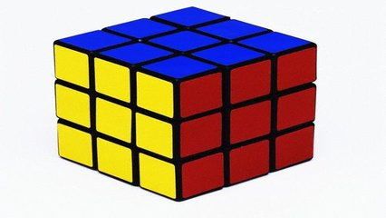

# Identificando um quadrado mágico



## Contexto

Dizemos que uma matriz quadrada inteira é um **quadrado mágico** se a soma dos elementos de cada linha, a soma dos elementos de cada coluna e a soma dos elementos das diagonais principal e secundária são todas iguais.

Sua tarefa é criar um programa que, dada uma matriz de inteiros 3x3, determine se ela é um quadrado mágico ou não.
  
### Entrada

- Uma matriz 3x3 de números inteiros. Cada linha da matriz será fornecida em uma nova linha de entrada, com os números separados por espaços.

### Saída

- A palavra **"sim"** se a matriz for um quadrado mágico.
- A palavra **"nao"** caso contrário.

### Restrições

- A matriz de entrada será sempre do tamanho 3x3.

## Testes

``` py
>>>>>>>> INSERT
1 2 3
4 5 6
7 8 9
======== EXPECT
nao
<<<<<<<< FINISH
```

```py
>>>>>>>> INSERT
2 7 6
9 5 1
4 3 8
======== EXPECT
sim
<<<<<<<< FINISH
```

```py
>>>>>>>> INSERT
8 1 6
3 5 7
4 9 2
======== EXPECT
sim
<<<<<<<< FINISH
```
