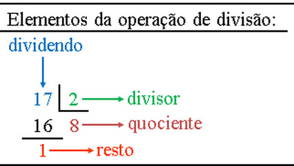

# Tipos de divisão



Na 5ª série, o professor prometeu um poder incrível: uma técnica secreta que eliminaria a necessidade de pensar em quociente e resto. Uma única divisão, dois números entrando e apenas um saindo. O sonho! O que ele esqueceu de mencionar foi a tal da vírgula e, às vezes, muitos números depois dela.

Sua tarefa é dominar os dois mundos da divisão. Crie um programa que, dados dois números inteiros, calcule e exiba o resultado da divisão inteira, o resto dessa divisão e o resultado da divisão "quebrada" (com ponto flutuante).

### Entrada

- Dois valores inteiros do usuário, **n1** e **n2**, um por linha.

### Saída

- **1ª linha:** O resultado da divisão inteira de **n1** por **n2**.
- **2ª linha:** O resto da divisão de **n1** por **n2**.
- **3ª linha:** O resultado da divisão com ponto flutuante, com 2 casas decimais.

### Restrições

- **n2** será sempre diferente de zero.

## Exemplos

<!-- load tests.toml --tests 2 -->
```py
>>>>>>>> INSERT
6
3
======== EXPECT
2
0
2.00
<<<<<<<< FINISH
```

```py
>>>>>>>> INSERT
7
3
======== EXPECT
2
1
2.33
<<<<<<<< FINISH
```
<!-- load -->

[Resolução](https://www.youtube.com/watch?v=budW2bakIjg)
