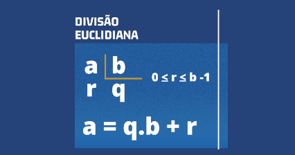

# Resultado e resto na divisão



## Contexto

Implemente um programa que receba dois inteiros positivos e calcule o valor do quociente e resto da divisão do primeiro pelo segundo número.

### Entrada

- Dois inteiros, um por linha

### Saída

- Quociente e resto separados por espaço

## Testes

```py
>>>>>>>> INSERT 0
51
31
======== EXPECT
1 20
<<<<<<<< FINISH
```

```py
>>>>>>>> INSERT 1
398
50
======== EXPECT
7 48
<<<<<<<< FINISH
```

```py
>>>>>>>> INSERT 2
350
40
======== EXPECT
8 30
<<<<<<<< FINISH
```

## Dicas

- Quando queremos saber o valor restante após uma divisão inteira, empregamos o operador módulo (`%`):

```c
// C
int resto = dividendo % divisor;
```

```py
# Python
resto = dividendo % divisor
```

```ts
// TypeScript
let resto = dividendo % divisor;
```

```go
// Só funciona para tipos inteiros
resto := dividendo % divisor
```