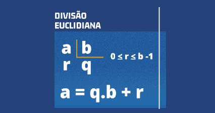

# @resto - resultado e resto na divisão



## Ação

Na cadeira de Matemática Díscreta, o professor irá apresentar o teorema da
divisão. Ele diz o seguinte:

**Teorema (Algoritmo da Divisão):** Seja ***n*** um inteiro qualquer e ***d*** um inteiro
positivo, existe um único par de inteiros ***q*** e ***r*** com ***0 ≤ r < d*** tais que:

$$n = d*q + r$$

Em outras palavras, dado dois inteiros positivos, por exemplo, 115 e 15,
podemos escrever 115 = 15*7 + 10, onde 7 e 10 são o quociente e o resto da
divisão de 115 por 15.

Implemente um programa que receba dois inteiros positivos e calcule o valor do
quociente e resto da divisão do primeiro pelo segundo número.

### Entrada

- Dois inteiros, um por linha

### Saída

- Quociente e resto separados por espaço

## Testes

```py
#INPUT 0
51
31
======== EXPECT
>>>>>>>> INSERT
<<<<<<<< FINISH
```

```py
#INPUT 1
398
50
======== EXPECT
>>>>>>>> INSERT
<<<<<<<< FINISH
```

```py
#INPUT 2
350
40
======== EXPECT
>>>>>>>> INSERT
<<<<<<<< FINISH
```

```py
#INPUT 3
587
460
======== EXPECT
>>>>>>>> INSERT
<<<<<<<< FINISH
```

```py
#INPUT 4
215
158
======== EXPECT
>>>>>>>> INSERT
<<<<<<<< FINISH
```

```py
#INPUT 5
760
360
======== EXPECT
>>>>>>>> INSERT
<<<<<<<< FINISH
```

```py
#INPUT 6
498
203
======== EXPECT
>>>>>>>> INSERT
<<<<<<<< FINISH
```

```py
#INPUT 7
61
25
======== EXPECT
>>>>>>>> INSERT
<<<<<<<< FINISH
```

```py
#INPUT 8
32
7
======== EXPECT
>>>>>>>> INSERT
<<<<<<<< FINISH
```

```py
#INPUT 9
873
254
======== EXPECT
>>>>>>>> INSERT
<<<<<<<< FINISH
```

```py
#INPUT 10
689
326
======== EXPECT
>>>>>>>> INSERT
<<<<<<<< FINISH
```

```py
#INPUT 11
939
155
======== EXPECT
>>>>>>>> INSERT
<<<<<<<< FINISH
```

```py
#INPUT 12
302
78
======== EXPECT
>>>>>>>> INSERT
<<<<<<<< FINISH
```

```py
#INPUT 13
584
318
======== EXPECT
>>>>>>>> INSERT
<<<<<<<< FINISH
```

```py
#INPUT 14
899
317
======== EXPECT
>>>>>>>> INSERT
<<<<<<<< FINISH
```

## Dicas

**C** - Quando queremos saber o valor restante após uma divisão inteira, empregamos o operador módulo (`%`):

```c
int main() {
    int resto = dividendo % divisor;
}
```

**Python** - Quando queremos saber o valor restante após uma divisão inteira, empregamos o operador módulo (`%`):

```py
resto = dividendo % divisor
```

**TypeScript** - Quando queremos saber o valor restante após uma divisão inteira, empregamos o operador módulo (`%`).:

```ts
let resto = dividendo % divisor;
```
