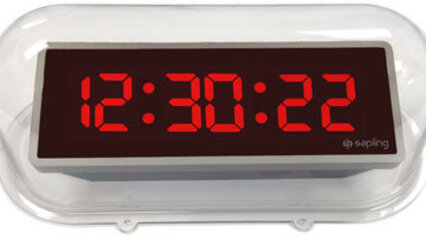

# Converter segundos em h:m:s



## Contexto

Implemente um programa que recebe um tempo em segundos e transformar no formato:

Hora:Minuto:Segundo

- A hora pode ser obtida pela divisão inteira do tempo por 3600.
- Agora pegue o resto de tempo por 3600, isso é o que sobrou pra minutos e segundos.
- A quantidade de minutos é obtida pela divisão inteira do resto por 60.
- O resto da divisão por 60 é a quantidade de segundos.

### Entrada

- Um único número inteiro representando o tempo em segundos.

### Saída

- Tempo formatado em Horas:Minutos:Segundos

## Testes

```py
>>>>>>>> INSERT
3641
======== EXPECT
1:0:41
<<<<<<<< FINISH
```

```py
>>>>>>>> INSERT
22067
======== EXPECT
6:7:47
<<<<<<<< FINISH
```

## Dicas

### Programando em: C

- Aqui está uma maneira de realizar impressão de variáveis junto com textos (strings) no terminal, utilizando o caractere `:` como separador. Os dois pontos podem ser substituídos por qualquer outro caractere:

```c
int main() {
    printf("%d:%d:%d", hora, minuto, segundo)
}
```

### Programando em: Python

- Aqui estão duas maneiras de realizar a impressão de variáveis junto com textos (strings) no terminal, utilizando o caractere `:` como separador. Os dois pontos podem ser substituídos por qualquer outro caractere:

```py
print(f"{hora}:{minuto}:{segundos}")
```

### Programando em: TypeScript

- Aqui estão duas maneiras de realizar a impressão de variáveis junto com textos (strings) no terminal, utilizando o caractere `:` como separador. Os dois pontos podem ser substituídos por qualquer outro caractere:

```ts
console.log(hora + ":" + minuto + ":" + segundo);
```

### Programando em: Go

- Aqui está uma maneira de realizar a impressão de variáveis junto com textos (strings) no terminal, utilizando o caractere `:` como separador. Os dois pontos podem ser substituídos por qualquer outro caractere:

```go
fmt.Printf("%d:%d:%d", hora, minuto, segundo)
```
