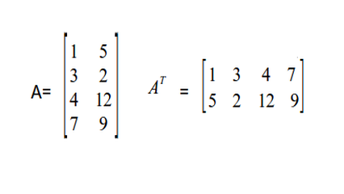

# Matrizes simétricas



Uma matriz diz-se simétrica se coincidir com a sua transposta, ou seja, se A = AT. Faça uma função que verifique se uma matriz 3x3 é simétrica ou não. Tenha como saida a informação "nao" se não for simétrica e "sim" caso contrário.

### Entrada

* Os valores da matriz.

### Saída

* "nao" se não for simétrica e "sim caso contrário.

### Exemplos

<!-- load tests.toml --tests 2 -->
```py
>>>>>>>> INSERT
1 4 7
4 1 8
7 8 1
======== EXPECT
sim
<<<<<<<< FINISH
```

```py
>>>>>>>> INSERT
3 3 3
3 3 3
3 3 3
======== EXPECT
sim
<<<<<<<< FINISH
```
<!-- load -->
