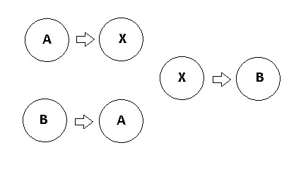

# Troca de valores de variáveis



Implemente a função `troca`, que recebe como parâmetro duas variáveis inteiras passadas por referência, e troca os valores destas variáveis.

## Draft

- lib.c: arquivo que você vai implementar a função `swap`.
- main.c: arquivo já implementado que contém a função `main` que chama a função `swap`.

<!-- links .cache/draft -->
<!-- links -->

Você deverá:

- Implementar a função 'troca'.
- Chamar a função 'troca' dentro da função 'main'.

## Exemplos

<!-- load tests.toml --tests 2 -->
```py
>>>>>>>> INSERT
1 2
======== EXPECT
2 1
<<<<<<<< FINISH
```

```py
>>>>>>>> INSERT
-1 3
======== EXPECT
3 -1
<<<<<<<< FINISH
```
<!-- load -->
