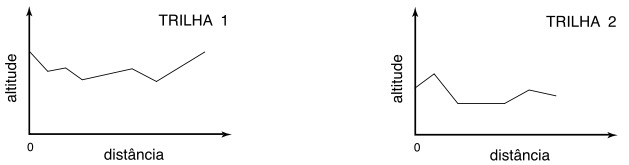

# Trilhas OBI 2005

Nos finais de semana Paulo faz longas caminhadas pelas bonitas trilhas que atravessam as matas vizinhas à sua cidade. Recentemente Paulo adquiriu um aparelho de GPS (siglas do inglês Sistema de Posicionamento Global) e com ele mapeou as mais belas trilhas da região. Paulo programou o GPS para armazenar, a intervalos regulares, a altitude do ponto corrente durante o trajeto. Assim, após percorrer as trilhas com o seu GPS, Paulo tem informações que permitem por exemplo produzir gráficos como os abaixo:  
  
Paulo tem uma nova namorada, e quer convencê-la a passear junto com ele pelas trilhas. Para o primeiro passeio juntos, Paulo quer escolher uma trilha "fácil". Segundo o seu critério, a trilha mais fácil é a que, em um dos sentidos do percurso, exige o menor esforço de subida. O esforço exigido em um trecho de subida é proporcional ao desnível do trecho.




Dadas as informações colhidas por Paulo sobre distâncias e altitudes de um conjunto de trilhas, você deve escrever um programa que determine qual é a trilha que exige o menor esforço de subida.  
  
### Entrada

- A primeira linha da entrada contém um número inteiro N que indica o número de trilhas.
- Cada uma das N linhas seguintes contém a descrição de uma trilha (1 ≤ N ≤ 100).
- As trilhas são identificadas por números de 1 a N .
- A ordem em que as trilhas aparecem na entrada determina os seus identificadores (a primeira trilha é a de número 1, a segunda a de número 2, a última a de número N ).
- A descrição de uma trilha inicia com um número inteiro M que indica a quantidade de pontos de medição da trilha (2 ≤ M ≤ 1000), seguido de M números inteiros Hi representando a altura dos pontos da trilha (medidos a intervalos regulares e iguais para todas as linhas).
- Paulo pode percorrer a trilha em qualquer sentido (ou seja, partindo do ponto de altitude H1 em direção ao ponto de altitude HM , ou partindo do ponto de altitude HM em direção ao ponto de altitude H1 ).
- A entrada deve ser lida do dispositivo de entrada padrão (normalmente o teclado).
  
### Saída

- Seu programa deve produzir uma única linha na saída, contendo um número inteiro representando o identificador da melhor trilha, conforme determinado pelo seu programa. Em caso de empate entre duas ou mais trilhas, imprima a de menor identificador.
- A saída deve ser escrita no dispositivo de saída padrão (normalmente a tela).  
  
Olimpíada Brasileira de Informática - OBI2005 - Modalidade Programação Nível 1  

## Dica

- Analise as trilhas em ambas as direções.
- Considere que descer não oferece esforço. Sempre que subir, incremente o tanto que subiu como esforço gasto.
- Ao final, informe a trilha que houve menor gasto de esforço subindo.

## Restrições

- 1 ≤ N ≤ 100  
- 2 ≤ M ≤ 1000  
- 0 ≤ Hi ≤ 1000

## Exemplos

<!-- load tests.toml --tests 2 -->
```py
>>>>>>>> INSERT
5
4 498 500 498 498
10 60 60 70 70 70 70 80 90 90 100
5 200 190 180 170 160
2 1000 900
4 20 20 20 20
======== EXPECT
2
<<<<<<<< FINISH
```

```py
>>>>>>>> INSERT
3
5 600 601 600 601 600
4 500 499 500 499
4 300 300 302 300
======== EXPECT
2
<<<<<<<< FINISH
```
<!-- load -->
