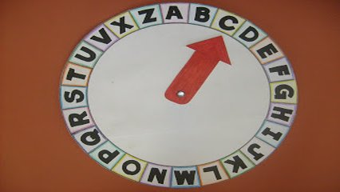

# Valdiskley e a cifra V1



Dado uma letra e um valor de rotação retorne a letra resultante. A rotação é realizada de forma circular entre as letras do alfabeto, ou seja, se a letra for 'z' e a rotação for 1, a letra resultante será 'a'. Se a letra for 'a' e a rotação for -1, a letra resultante será 'z'.

### Entrada

* Letra minuscula entre 'a' e 'z'
* Um valor inteiro positivo ou negativo onde negativo significa um rotação pra frente e negativo uma rotação pra trás.

### Saída

* A letra resultante

### Exemplos

<!-- load tests.toml --tests 4 -->
```py
>>>>>>>> INSERT
a
0
======== EXPECT
a
<<<<<<<< FINISH
```

```py
>>>>>>>> INSERT
b
3
======== EXPECT
e
<<<<<<<< FINISH
```

```py
>>>>>>>> INSERT
z
2
======== EXPECT
b
<<<<<<<< FINISH
```

```py
>>>>>>>> INSERT
f
-3
======== EXPECT
c
<<<<<<<< FINISH
```
<!-- load -->
