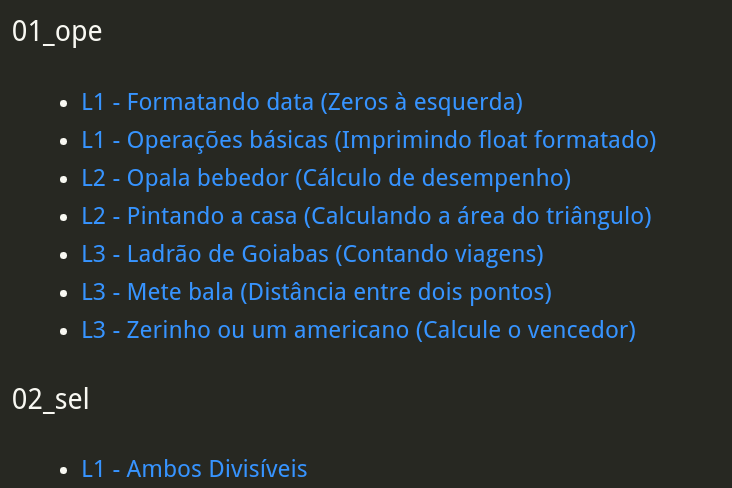
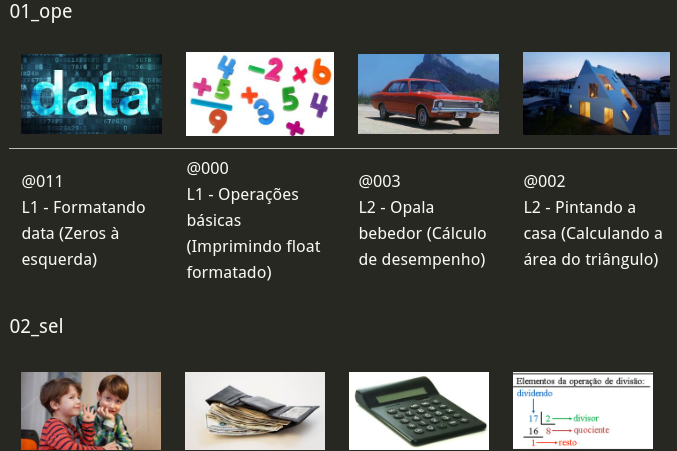

## Lista de atividades de FUP
## @qxcode

 |  
:-:|:-:
**List** | **Photo Board**

## Links
- [Operações](#operações)
- [Seleção](#seleção)
- [Repetição](#repetição)
- [Vetores](#vetores)
- [Funções](#funções)
- [Ponteiros](#ponteiros)
- [Strings](#strings)
- [Matrizes](#matrizes)
- [Structs](#structs)
- [Recursão](#recursão)
- [__orphan__](#__orphan__)

## Operações

- [L1 - Formatando data](base/011/Readme.md#operacoes-l1---formatando-data)
- [L1 - Operações básicas](base/000/Readme.md#operacoes-l1---operações-básicas)
- [L2 - Opala bebedor](base/003/Readme.md#operacoes-l2---opala-bebedor)
- [L2 - Pintando a casa](base/002/Readme.md#operacoes-l2---pintando-a-casa)
- [L3 - Ladrão de Goiabas](base/005/Readme.md#operacoes-l3---ladrão-de-goiabas)
- [L3 - Mete bala](base/004/Readme.md#operacoes-l3---mete-bala)
- [L3 - Zerinho ou um americano](base/006/Readme.md#operacoes-l3---zerinho-ou-um-americano)

## Seleção

- [L1 - Ambos Divisíveis](base/025/Readme.md#selecao-l1---ambos-divisíveis)
- [L1 - Angulo Cartesiano](base/062/Readme.md#selecao-l1---angulo-cartesiano)
- [L1 - Calculadora Numérica](base/015/Readme.md#selecao-l1---calculadora-numérica)
- [L1 - Divisão Inteira e Quebrada](base/024/Readme.md#selecao-l1---divisão-inteira-e-quebrada)
- [L1 - Impedido!](base/151/Readme.md#selecao-l1---impedido)
- [L1 - Jogo de par ou ímpar](base/156/Readme.md#selecao-l1---jogo-de-par-ou-ímpar)
- [L1 - Plantação de Morangos](base/155/Readme.md#selecao-l1---plantação-de-morangos)
- [L1 - Positivo, Nulo ou Negativo?](base/026/Readme.md#selecao-l1---positivo-nulo-ou-negativo)
- [L2 - A hora do próximo segundo](base/038/Readme.md#selecao-l2---a-hora-do-próximo-segundo)
- [L2 - Adedonha na Califórnia](base/027/Readme.md#selecao-l2---adedonha-na-califórnia)
- [L2 - Arrendondar](base/018/Readme.md#selecao-l2---arrendondar)
- [L2 - Aumento de Salário](base/021/Readme.md#selecao-l2---aumento-de-salário)
- [L2 - Bolada na fuça](base/032/Readme.md#selecao-l2---bolada-na-fuça)
- [L2 - Cadê a cabeça da cobra](base/028/Readme.md#selecao-l2---cadê-a-cabeça-da-cobra-noticia)
- [L2 - Criança, Adulto, Idoso, Múmia](base/183/Readme.md#selecao-l2---criança-adulto-idoso-múmia)
- [L2 - Fiquei de final](base/031/Readme.md#selecao-l2---fiquei-de-final)
- [L2 - Mercantil V1 - Quem chega mais perto](base/030/Readme.md#selecao-l2---mercantil-v1---quem-chega-mais-perto)
- [L2 - Mercantil V2 - Maior ou Menor](base/039/Readme.md#selecao-l2---mercantil-v2---maior-ou-menor)
- [L2 - OBI 2017 - Fase 1 - Drone de Entrega](base/035/Readme.md#selecao-l2---obi-2017---fase-1---drone-de-entrega)
- [L2 - OBI 2017 - Fase 1 - Teleférico](base/022/Readme.md#selecao-l2---obi-2017---fase-1---teleférico)
- [L2 - OBI 2017 - Fase 1 - Universitário - Game 10](base/019/Readme.md#selecao-l2---obi-2017---fase-1---universitário---game-10)
- [L2 - Ovos de galinha (Procurando o Maior valor)](base/017/Readme.md#selecao-l2---ovos-de-galinha-procurando-o-maior-valor)
- [L2 - Quantos são iguais? (Contando Repetidos)](base/014/Readme.md#selecao-l2---quantos-são-iguais-contando-repetidos)
- [L2 - Quiz do Harry Potter](base/029/Readme.md#selecao-l2---quiz-do-harry-potter)
- [L2 - Zerinho ou Um!](base/020/Readme.md#selecao-l2---zerinho-ou-um)
- [L3 - Dorme Tarde Acordar Cedo!](base/043/Readme.md#selecao-l3---dorme-tarde-acordar-cedo)
- [L3 - Está Trabalhand ou Não!](base/040/Readme.md#selecao-l3---está-trabalhand-ou-não)
- [L3 - Formiga da bundona](base/034/Readme.md#selecao-l3---formiga-da-bundona)
- [L3 - Frota de Táxi - OBI 2005](base/157/Readme.md#selecao-l3---frota-de-táxi---obi-2005)
- [L3 - Jokenpo 15](base/037/Readme.md#selecao-l3---jokenpo-15)
- [L3 - Jokenpo das tartarugas!](base/023/Readme.md#selecao-l3---jokenpo-das-tartarugas)
- [L3 - Morre o do meio](base/036/Readme.md#selecao-l3---morre-o-do-meio)
- [L3 - Professor Bonzinho](base/033/Readme.md#selecao-l3---professor-bonzinho)
- [L3 - Rufus e Ordenação!](base/042/Readme.md#selecao-l3---rufus-e-ordenação)
- [L3 - Rufus e Par ou Ímpar!](base/041/Readme.md#selecao-l3---rufus-e-par-ou-ímpar)
- [L3 - Sai fora Bhaskara (Cálculo de raízes)](base/001/Readme.md#selecao-l3---sai-fora-bhaskara-cálculo-de-raízes)

## Repetição

- [L1 - Calça Zeze de Camargo - Mínimo](base/056/Readme.md#repeticao-l1---calça-zeze-de-camargo---mínimo)
- [L1 - Dividindo pares de sapatos pra três](base/013/Readme.md#repeticao-l1---dividindo-pares-de-sapatos-pra-três)
- [L1 - Quantos Ultrons você vê - Contar Elemento](base/055/Readme.md#repeticao-l1---quantos-ultrons-você-vê---contar-elemento)
- [L1 - Somatório V2](base/044/Readme.md#repeticao-l1---somatório-v2)
- [L1 - Zero é par - Somatório de Pares!](base/045/Readme.md#repeticao-l1---zero-é-par---somatório-de-pares)
- [L2 - Busca Intervalada](base/058/Readme.md#repeticao-l2---busca-intervalada)
- [L2 - Cabo de Guerra Jedi](base/048/Readme.md#repeticao-l2---cabo-de-guerra-jedi)
- [L2 - Castelos de Cubos](base/050/Readme.md#repeticao-l2---castelos-de-cubos)
- [L2 - Jogo da Concentração](base/046/Readme.md#repeticao-l2---jogo-da-concentração)
- [L2 - Revolta em Portugal](base/057/Readme.md#repeticao-l2---revolta-em-portugal)
- [L2 - Sapinho 1 no Poço](base/049/Readme.md#repeticao-l2---sapinho-1-no-poço)
- [L2 - Trilhas - OBI 2005 - (Modo Easy)](base/136/Readme.md#repeticao-l2---trilhas---obi-2005---modo-easy)
- [L2 - Volta de 360 graus (Retirando os loops)](base/016/Readme.md#repeticao-l2---volta-de-360-graus-retirando-os-loops)
- [L2 - Ônibus lotado](base/047/Readme.md#repeticao-l2---ônibus-lotado)
- [L3 - Arremesso de pedra na lua](base/051/Readme.md#repeticao-l3---arremesso-de-pedra-na-lua)
- [L3 - Bafo - OBI 2005](base/160/Readme.md#repeticao-l3---bafo---obi-2005)
- [L3 - Blackjack 21!](base/063/Readme.md#repeticao-l3---blackjack-21)
- [L3 - Conta Dígitos](base/064/Readme.md#repeticao-l3---conta-dígitos)
- [L3 - Hoje tem sopa de coelho?](base/052/Readme.md#repeticao-l3---hoje-tem-sopa-de-coelho)
- [L3 - OBI 2016 - Fuga em helicóptero](base/053/Readme.md#repeticao-l3---obi-2016---fuga-em-helicóptero)
- [L3 - Quebrador de Copos](base/054/Readme.md#repeticao-l3---quebrador-de-copos)
- [L3 - Sapinho 2 morrendo no poço](base/059/Readme.md#repeticao-l3---sapinho-2-morrendo-no-poço)
- [L3 - Sapinho 3 matemático não morrendo no poço](base/065/Readme.md#repeticao-l3---sapinho-3-matemático-não-morrendo-no-poço)
- [L3 - Spok Palíndromo](base/066/Readme.md#repeticao-l3---spok-palíndromo)
- [L3 - Trilhas - OBI 2005](base/158/Readme.md#repeticao-l3---trilhas---obi-2005)
- [L3 - Vivo ou Morto - OBI 2005](base/161/Readme.md#repeticao-l3---vivo-ou-morto---obi-2005)

## Vetores

- [L1 - Joelison Fernandes - Soma do maior e menor!](base/060/Readme.md#vetores-l1---joelison-fernandes---soma-do-maior-e-menor)
- [L2 - Capoeira invertendo vetor!](base/061/Readme.md#vetores-l2---capoeira-invertendo-vetor)
- [L2 - Jogo do Avesso](base/078/Readme.md#vetores-l2---jogo-do-avesso)
- [L2 - MMC](base/091/Readme.md#vetores-l2---mmc)
- [L2 - Mostrar mão de cartas](base/101/Readme.md#vetores-l2---mostrar-mão-de-cartas)
- [L2 - Organizando a fila do RU](base/068/Readme.md#vetores-l2---organizando-a-fila-do-ru)
- [L2 - Primo](base/090/Readme.md#vetores-l2---primo)
- [L2 - Processando uma linha de inteiros](base/186/Readme.md#vetores-l2---processando-uma-linha-de-inteiros)
- [L2 - Queda de dominós](base/067/Readme.md#vetores-l2---queda-de-dominós)
- [L2 - Soldados Pequenos e Grandes!](base/072/Readme.md#vetores-l2---soldados-pequenos-e-grandes)
- [L3 - Abastecimento de água](base/075/Readme.md#vetores-l3---abastecimento-de-água)
- [L3 - Anfíbios e Batráquios - Está contido](base/083/Readme.md#vetores-l3---anfíbios-e-batráquios---está-contido)
- [L3 - As unhas de Luiza - Vetor para inteiro](base/082/Readme.md#vetores-l3---as-unhas-de-luiza---vetor-para-inteiro)
- [L3 - Baruel Ruel trocando figurinhas!](base/080/Readme.md#vetores-l3---baruel-ruel-trocando-figurinhas)
- [L3 - Batida Policial - Ordenando vetores](base/073/Readme.md#vetores-l3---batida-policial---ordenando-vetores)
- [L3 - Bolinhas viciadas(contagem de repetições)](base/010/Readme.md#vetores-l3---bolinhas-viciadascontagem-de-repetições)
- [L3 - Cabeças vão rolar](base/070/Readme.md#vetores-l3---cabeças-vão-rolar)
- [L3 - Coleção de Tazos - Quantos se repetem mais](base/086/Readme.md#vetores-l3---coleção-de-tazos---quantos-se-repetem-mais)
- [L3 - Exército - Perto da morte](base/085/Readme.md#vetores-l3---exército---perto-da-morte)
- [L3 - Força Bruta (Gerando próxima combinação)](base/008/Readme.md#vetores-l3---força-bruta-gerando-próxima-combinação)
- [L3 - Jogando pião na rodinha](base/100/Readme.md#vetores-l3---jogando-pião-na-rodinha)
- [L3 - Jogo do Avesso V2](base/079/Readme.md#vetores-l3---jogo-do-avesso-v2)
- [L3 - Loucura de Marquinhos - Decompor um inteiro](base/081/Readme.md#vetores-l3---loucura-de-marquinhos---decompor-um-inteiro)
- [L3 - MMC de vários números.](base/139/Readme.md#vetores-l3---mmc-de-vários-números)
- [L3 - Mercantil V3 - Muitas rodadas](base/077/Readme.md#vetores-l3---mercantil-v3---muitas-rodadas)
- [L3 - Mini-Poker - OBI2005](base/162/Readme.md#vetores-l3---mini-poker---obi2005)
- [L3 - Mário e o Assassins Creed - Parkour](base/071/Readme.md#vetores-l3---mário-e-o-assassins-creed---parkour)
- [L3 - OBI 2017 - Fase 1 - Botas Trocadas](base/074/Readme.md#vetores-l3---obi-2017---fase-1---botas-trocadas)
- [L3 - OBI 2017 - Fase 1 - O segredo do Cofre](base/076/Readme.md#vetores-l3---obi-2017---fase-1---o-segredo-do-cofre)
- [L3 - Se fosse a mediana eu tinha passado!](base/088/Readme.md#vetores-l3---se-fosse-a-mediana-eu-tinha-passado)
- [L3 - Vetor interativo](base/185/Readme.md#vetores-l3---vetor-interativo)
- [L3 - Zoo quantas especies!](base/069/Readme.md#vetores-l3---zoo-quantas-especies)
- [L3 - Zoologico Entrando na Arca de Noé](base/087/Readme.md#vetores-l3---zoologico-entrando-na-arca-de-noé)
- [L3 - Zoologico Um animal de cada tipo!](base/084/Readme.md#vetores-l3---zoologico-um-animal-de-cada-tipo)

## Funções

- [L2 - Imprimir vetor formatado](base/009/Readme.md#funcoes-l2---imprimir-vetor-formatado)

## Ponteiros

- [L1 - Duelo](base/147/Readme.md#ponteiros-l1---duelo)
- [L1 - Troca de valores de variáveis](base/143/Readme.md#ponteiros-l1---troca-de-valores-de-variáveis)
- [L2 - Função que retorna vários valores por referência](base/144/Readme.md#ponteiros-l2---função-que-retorna-vários-valores-por-referência)
- [L2 - Vetor de strings com variados tamanhos](base/142/Readme.md#ponteiros-l2---vetor-de-strings-com-variados-tamanhos)
- [L3 - Motivando a turma de secundaristas](base/184/Readme.md#ponteiros-l3---motivando-a-turma-de-secundaristas)

## Strings

- [L1 - Eribelton e a Ascologia V1 - Somar Asc](base/173/Readme.md#strings-l1---eribelton-e-a-ascologia-v1---somar-asc)
- [L1 - LP da Xura - Inverter String!](base/092/Readme.md#strings-l1---lp-da-xura---inverter-string)
- [L1 - Maiúsculo, Minusculo e Dígito!](base/104/Readme.md#strings-l1---maiúsculo-minusculo-e-dígito)
- [L1 - Marileuza e as Alcaparras - Contar Ocorrencias!](base/177/Readme.md#strings-l1---marileuza-e-as-alcaparras---contar-ocorrencias)
- [L1 - Substring na decoração - Obter Substrings!](base/176/Readme.md#strings-l1---substring-na-decoração---obter-substrings)
- [L1 - Valdiskey e a cifra V1!](base/174/Readme.md#strings-l1---valdiskey-e-a-cifra-v1)
- [L2 - Avestruz com Alcaparras](base/095/Readme.md#strings-l2---avestruz-com-alcaparras)
- [L2 - Contar Leds](base/096/Readme.md#strings-l2---contar-leds)
- [L2 - Crushômetro](base/126/Readme.md#strings-l2---crushômetro)
- [L2 - Eribelton e a Ascologia V2](base/109/Readme.md#strings-l2---eribelton-e-a-ascologia-v2)
- [L2 - Gagueira V1 - Duplicar Palavras](base/097/Readme.md#strings-l2---gagueira-v1---duplicar-palavras)
- [L2 - Gritando em Caixa Alta](base/093/Readme.md#strings-l2---gritando-em-caixa-alta)
- [L2 - Guerra Civil no Universo Marvel](base/180/Readme.md#strings-l2---guerra-civil-no-universo-marvel)
- [L2 - Mega Jokenpo!](base/089/Readme.md#strings-l2---mega-jokenpo)
- [L2 - Meu cachorro comeu minha tarefa](base/111/Readme.md#strings-l2---meu-cachorro-comeu-minha-tarefa)
- [L2 - Numerão Divisível por 11](base/125/Readme.md#strings-l2---numerão-divisível-por-11)
- [L2 - Organizando Ru - Homens e Mulheres!](base/110/Readme.md#strings-l2---organizando-ru---homens-e-mulheres)
- [L2 - Somando numeros](base/181/Readme.md#strings-l2---somando-numeros)
- [L2 - Valdiskley e a cifra V2!](base/106/Readme.md#strings-l2---valdiskley-e-a-cifra-v2)
- [L2 - Vogais e Consoantes](base/094/Readme.md#strings-l2---vogais-e-consoantes)
- [L3 - Amo a Amora meu Amor](base/127/Readme.md#strings-l3---amo-a-amora-meu-amor)
- [L3 - Aniquilando Ultrons V3](base/118/Readme.md#strings-l3---aniquilando-ultrons-v3)
- [L3 - Conversa de Traficantes](base/124/Readme.md#strings-l3---conversa-de-traficantes)
- [L3 - Eribelton e a Ascologia V3](base/113/Readme.md#strings-l3---eribelton-e-a-ascologia-v3)
- [L3 - Francês é Fresco](base/099/Readme.md#strings-l3---francês-é-fresco)
- [L3 - Gansos Gamados](base/120/Readme.md#strings-l3---gansos-gamados)
- [L3 - Identificando Ultrons V2](base/117/Readme.md#strings-l3---identificando-ultrons-v2)
- [L3 - Identificando elementos](base/108/Readme.md#strings-l3---identificando-elementos)
- [L3 - Jack Sparrow e o Beijinho](base/178/Readme.md#strings-l3---jack-sparrow-e-o-beijinho)
- [L3 - Jason e Krueguer](base/098/Readme.md#strings-l3---jason-e-krueguer)
- [L3 - Letras Ordenadas](base/152/Readme.md#strings-l3---letras-ordenadas)
- [L3 - Matéria e Antimatéia](base/119/Readme.md#strings-l3---matéria-e-antimatéia)
- [L3 - MeU WoRd QuEbRoU](base/114/Readme.md#strings-l3---meu-word-quebrou)
- [L3 - Meu cachorro comeu minha tarefa V2](base/102/Readme.md#strings-l3---meu-cachorro-comeu-minha-tarefa-v2)
- [L3 - Máquina de Datilografar Quebrada](base/115/Readme.md#strings-l3---máquina-de-datilografar-quebrada)
- [L3 - Mário e o Assassins Creed](base/121/Readme.md#strings-l3---mário-e-o-assassins-creed)
- [L3 - Nao se bububula - Gagueira V2!](base/122/Readme.md#strings-l3---nao-se-bububula---gagueira-v2)
- [L3 - Prof Muquirana - Busca máximo por critério](base/179/Readme.md#strings-l3---prof-muquirana---busca-máximo-por-critério)
- [L3 - Rocicleia e o Locioreca - Anagramas!](base/112/Readme.md#strings-l3---rocicleia-e-o-locioreca---anagramas)
- [L3 - Roda Roda Jequiti](base/116/Readme.md#strings-l3---roda-roda-jequiti)
- [L3 - Separando a partir de tokens](base/175/Readme.md#strings-l3---separando-a-partir-de-tokens)
- [L3 - Separe Pneumatocito - Separação de Palavras!](base/103/Readme.md#strings-l3---separe-pneumatocito---separação-de-palavras)
- [L3 - Sorvete suor casaca chicletes - Letras em Comum!](base/123/Readme.md#strings-l3---sorvete-suor-casaca-chicletes---letras-em-comum)
- [L3 - Valdiskley e a Cifra v3!](base/107/Readme.md#strings-l3---valdiskley-e-a-cifra-v3)
- [L3 - Valdiskley e cifras históricas!](base/105/Readme.md#strings-l3---valdiskley-e-cifras-históricas)

## Matrizes

- [L2 - Bingo!](base/130/Readme.md#matrizes-l2---bingo)
- [L2 - Deu a louca no Imperador!](base/012/Readme.md#matrizes-l2---deu-a-louca-no-imperador)
- [L2 - Quadrado Mágico](base/134/Readme.md#matrizes-l2---quadrado-mágico)
- [L2 - Soldados em Posição](base/133/Readme.md#matrizes-l2---soldados-em-posição)
- [L2 - Soma de elementos de em uma matriz](base/128/Readme.md#matrizes-l2---soma-de-elementos-de-em-uma-matriz)
- [L2 - Soma de matrizes](base/150/Readme.md#matrizes-l2---soma-de-matrizes)
- [L3 - Campo Minado](base/129/Readme.md#matrizes-l3---campo-minado)
- [L3 - Campo de Minhocas - OBI 2005](base/159/Readme.md#matrizes-l3---campo-de-minhocas---obi-2005)
- [L3 - Jogo da vida](base/135/Readme.md#matrizes-l3---jogo-da-vida)
- [L3 - Matriz Simétrica](base/131/Readme.md#matrizes-l3---matriz-simétrica)
- [L3 - OBI 2015 - Fase 2 - Nível 1 - Torre](base/153/Readme.md#matrizes-l3---obi-2015---fase-2---nível-1---torre)
- [L3 - OBI 2015 - Fase 2 - Nível Júnior - Código](base/154/Readme.md#matrizes-l3---obi-2015---fase-2---nível-júnior---código)
- [L3 - Subdiagonais](base/132/Readme.md#matrizes-l3---subdiagonais)
- [L3 - Tetris (Fazendo a peça cair)](base/007/Readme.md#matrizes-l3---tetris-fazendo-a-peça-cair)

## Structs

- [L1 - Expressão](base/148/Readme.md#structs-l1---expressão)
- [L1 - Operações](base/149/Readme.md#structs-l1---operações)
- [L2 - Jogo da cobrinha](base/187/Readme.md#structs-l2---jogo-da-cobrinha)
- [L3 - Mulher mais idosa](base/182/Readme.md#structs-l3---mulher-mais-idosa)

## Recursão

- [L2 - Contando caracteres recursivamente](base/145/Readme.md#recursao-l2---contando-caracteres-recursivamente)
- [L2 - Números de Fibonacci](base/141/Readme.md#recursao-l2---números-de-fibonacci)
- [L3 - Contando caracteres recursivamente](base/140/Readme.md#recursao-l3---contando-caracteres-recursivamente)
- [L3 - Torres de Hanoi](base/146/Readme.md#recursao-l3---torres-de-hanoi)

## __orphan__

- [Devolvendo o troco com vetores](base/188/Readme.md#devolvendo-o-troco-com-vetores)
